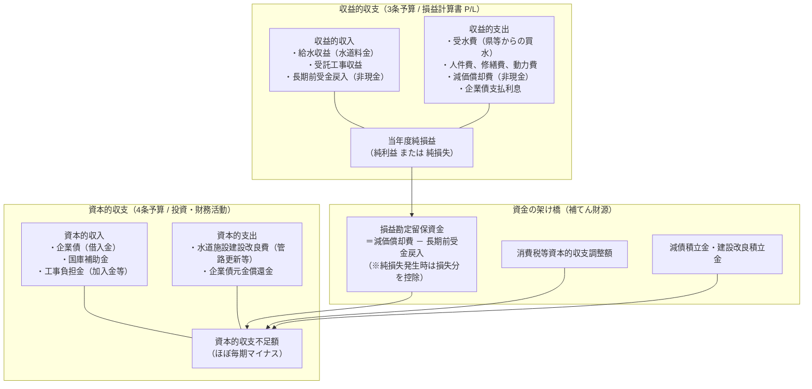

# 公営企業会計実務Q&A（水道事業編）解説まとめ

本書は、総務省公営企業課等が公表した公式の実務指針集**『公営企業会計適用後の会計業務に関するQ＆A集（令和5年3月更新）』（ファイル名：`000873733 (1).xlsm`／全658問収録）**をベースに、水道事業の現場で直面する会計・予算・決算の実務論点を体系的に抽出し、初学者から実務担当者まで直感的に理解できるよう整理した解説ドキュメントです。

---

## 目次

1. [資料の概要と位置づけ](#1-資料の概要と位置づけ)
2. [水道事業会計の全体構造と基本ルール](#2-水道事業会計の全体構造と基本ルール)
3. [第1章：有形固定資産（水道施設・管路）の実務論点](#3-第1章有形固定資産水道施設管路の実務論点)
   - 3-1. 「修繕費（3条）」か「資産計上（4条）」かの境界判断
   - 3-2. 老朽管更新・耐震化工事の耐用年数と資産計上
   - 3-3. 舗装本復旧工事・付随費用・建設仮勘定
   - 3-4. 施設の除却（撤去・廃止）と固定資産除却損
   - 3-5. 遊休施設・廃止施設の「減損会計」
4. [第2章：繰延収益（長期前受金）と補助金・負担金の実務](#4-第2章繰延収益長期前受金と補助金負担金の実務)
   - 4-1. なぜ補助金や工事負担金が「負債（繰延収益）」になるのか
   - 4-2. 減価償却見合いの戻入計算
   - 4-3. 資産を除却したときの長期前受金の処理
   - 4-4. 企業債元金償還繰入金の長期前受金化
   - 4-5. 受贈財産（寄附受け）の処理と損益中立性
5. [第3章：企業債（地方債）と資金調達](#5-第3章企業債地方債と資金調達)
   - 5-1. 企業債の基本と元利償還の分離
   - 5-2. 一時借入金と企業債の違い
6. [第4章：予算と「資本的収支の補てん財源」の完全攻略（最重要）](#6-第4章予算と資本的収支の補てん財源の完全攻略最重要)
   - 6-1. 資本的収支の不足額と補てんの仕組み
   - 6-2. 損益勘定留保資金の正確な計算式
   - 6-3. 当年度純損失（赤字）が出たときの落とし穴
   - 6-4. 補てん財源の使用優先順位
7. [第5章：引当金・未収金・債権管理の実務](#7-第5章引当金未収金債権管理の実務)
   - 7-1. 水道料金未収金と「貸倒引当金」
   - 7-2. 賞与引当金・退職給付引当金
8. [第6章：消費税経理と「消費税等資本的収支調整額」](#8-第6章消費税経理と消費税等資本的収支調整額)
   - 8-1. 3条（税抜）と4条（税込）のねじれ
   - 8-2. 消費税等資本的収支調整額の計算方法
9. [実務・研修・クイズで頻出する「重要Q&A厳選15問」](#9-実務研修クイズで頻出する重要qa厳選15問)

---

## 1. 資料の概要と位置づけ

### 原典情報
- **文書名**：『公営企業会計適用後の会計業務に関するQ＆A集（令和5年3月）』
- **発行元**：総務省 自治財政局 公営企業課
- **ファイル構成**：Excelマクロ有効ブック（`.xlsm`）、全658行の問答リスト
- **対象読者**：法適用企業（水道、下水道、交通、病院等）の実務担当者、公認会計士、監査委員

### 本資料の目的
地方公営企業法（以下「法」）、同施行令（「令」）、同法施行規則（「則」）、地方公営企業が会計を整理するに当たりよるべき指針（「指針」）に基づき、**自治体現場から実際に寄せられた具体的かつ実践的な疑義に対する国の公式回答**をまとめたものです。

---

## 2. 水道事業会計の全体構造と基本ルール

水道事業会計は、日々の営業損益を表す**「収益的収支（法第3条予算）」**と、施設建設・借入返済を表す**「資本的収支（法第4条予算）」**の二面構造を持っています。



---

## 3. 第1章：有形固定資産（水道施設・管路）の実務論点

水道事業の資産の大半は、地下に埋設された水道管や浄水場などの**「有形固定資産」**です。現場で最も多い判断業務がここに集中しています。

### 3-1. 「修繕費（3条）」か「資産計上（4条）」かの境界判断
工事や修繕を行った際、これを当期の費用（修繕費）とするか、固定資産（資本的支出）として資産計上するかの判断基準です。

> **Q&Aの公式回答要旨（資産/有形固定資産/取得）：**  
> 「固定資産の耐用年数期間中の活動に耐えさせ、かつその持っている能率を十分に発揮させるために支出した費用であれば**修繕費（収益的支出）**として計上する。  
> 一方で、当該固定資産が本来持っている**能率を向上**させ、または**耐用年数を延長**させる支出であれば、**固定資産（資本的支出）**として計上する。」

| 区分 | 目的 | 会計上の扱い | 予算区分 | 具体例 |
|---|---|---|---|---|
| **修繕費（収益的支出）** | 現状維持、機能回復 | 当期の費用（P/L） | 3条支出 | 漏水修繕、バルブのパッキン交換、ポンプの通常点検・部分補修 |
| **資本的支出（資産計上）** | 性能向上、耐用年数延長、新規取得 | 固定資産に加算（B/S） | 4条支出 | 水道管の布設替、耐震継手化、浄水設備の高効率ポンプへの総入替 |

- **金額基準の注意点**：数十万円程度であっても、機能向上や耐用年数延長を伴わない通常の部品交換・修復であれば修繕費として処理します。

### 3-2. 老朽管更新・耐震化工事の耐用年数と資産計上
- **耐震化工事の耐用年数**：既存の管路やマンホールに耐震化補強工事を実施した場合、既存管の残り年数に合わせるのではなく、**「新設工事と同様に、供用開始日より新規取得資産として耐用年数（配水管なら40年等）を設定する」**ことが適当とされています。
- **法定耐用年数の延長はできるか？**：
  - アセットマネジメントで「管が60年以上持つ」と評価された場合でも、**耐用年数を法定年数より長く延長することは原則認められません**（則第15条第1項・第4項）。
  - 規則第15条第4項で使用可能期間への変更が認められるのは、**「使用可能期間が法定耐用年数より著しく短い場合」**の特例（6事由）に限られます。

### 3-3. 舗装本復旧工事・付随費用・建設仮勘定
- **建設仮勘定の活用**：年度をまたぐ工事や、年度末時点でまだ完成・供用開始していない工事費は、いったん「建設仮勘定」にプールします。
- **舗装本復旧工事の扱い**：
  - 管路布設工事を行った翌年度に「舗装の本復旧工事」を行う場合、本復旧までが一連の工事であれば、翌年度の本復旧工事費は**付随費用として資産の取得原価に加算**し、一連の工事が完了した時点で本勘定（管路等）へ振り替えて供用開始（減価償却開始）とします。

### 3-4. 施設の除却（撤去・廃止）と固定資産除却損
水道管の布設替や浄水場の統廃合により既存施設を撤去・廃止したときの手続きです。

1. **帳簿価額の除却**：
   - 撤去した資産の帳簿未償却残高は、**「固定資産除却損（特別損失）」**に計上して資産台帳から落とします。
2. **撤去費用の計上**：
   - 施設の解体・撤去のために要した工事費用は、原則として**特別損失（固定資産撤去費）または除却損**に含めて計上します。
3. **重要：長期前受金の戻入処理**：
   - 撤去した施設が過去に国庫補助金や工事負担金（加入金等）で作られていた場合、帳簿に残っている長期前受金（負債）を一括で取り崩し、**「長期前受金戻入」として営業外収益（または特別利益）に計上**します。

### 3-5. 遊休施設・廃止施設の「減損会計」
市町村合併や水需要減少に伴い、統廃合で使用されなくなった浄水場やポンプ場が現地に残っている場合：
- 現地にあるからといって通常の減価償却を漫然と続けてはいけません。
- 将来の使用見込みがない「遊休資産」として、帳簿価額を回収可能価額まで一気に切り下げる**「減損損失（特別損失）」の計上**を検討する必要があります。

---

## 4. 第2章：繰延収益（長期前受金）と補助金・負担金の実務

公営企業会計で最も初学者がつまずきやすいのが**「長期前受金（ちょうきまえうけきん）」**です。

### 4-1. なぜ補助金や工事負担金が「負債（繰延収益）」になるのか
一般会計では国庫補助金をもらうとその年の「歳入」になりますが、企業会計では**負債の部の「繰延収益（長期前受金）」**に計上します。

```
【理由：費用と収益の期間対応】
1. 補助金4,000万円をもらって耐用年数40年の施設を作ったとする。
2. 補助金を初年度に全額「利益（収入）」にしてしまうと、初年度だけ大黒字になり、
   翌年以降40年間は減価償却費（費用）だけが発生して毎期大赤字になってしまう。
3. そこで、補助金をいったん「負債（将来の収益の前受け）」として預かっておき、
   施設の減価償却費の発生に合わせて、40年かけて毎年100万円ずつ収益（長期前受金戻入）化していく。
```

### 4-2. 減価償却見合いの戻入計算
- **対象となる財源**：国庫補助金、県補助金、受益者負担金、工事負担金（給水加入金など）、一般会計出資金のうち特定財源に充てられたもの。
- **計算方法**：
  $$\text{毎期の長期前受金戻入額} = \text{当期の減価償却費} \times \left( \frac{\text{取得財源中の補助金・負担金等の額}}{\text{資産の取得価額}} \right)$$
- **注意：企業債（借入金）は長期前受金にはならない！**  
  借入金は将来返済しなければならない「確定した負債」であり、返済免除される補助金ではないため、長期前受金の対象には含まれません。

### 4-3. 資産を除却したときの長期前受金の処理
耐用年数の途中で施設を除却（廃棄・布設替）した場合：
- 未償却残高を「固定資産除却損」として特別損失に計上すると同時に、
- **見合いの未戻入長期前受金残高も全額取り崩して「長期前受金戻入」として計上**します（則第21条第2項）。これにより、資産側と補助金側の残高が両方ゼロになり整合します。

### 4-4. 企業債元金償還繰入金の長期前受金化
水道事業の建設改良のために借り入れた企業債の「元金償還」に対して一般会計から繰入金（基準内繰入金など）を受ける場合：
- この繰入金は実質的に「施設整備に対する補助金」と同じ性質を持つため、**「長期前受金」として整理**し、資産の耐用年数や減価償却割合に応じて収益化していきます。

### 4-5. 受贈財産（寄附受け）の処理と損益中立性
宅地開発に伴い、開発業者から配水管や給水設備を無償で譲り受けた（寄附採納）場合：
1. **資産側**：適正な評価額（再調達原価等）で「配水管」等の固定資産に計上。
2. **財源側**：同額を「長期前受金（受贈財産評価額）」に計上。
3. **毎期の減価償却**：資産から発生する「減価償却費（費用）」と、長期前受金から戻し入れる「長期前受金戻入（収益）」が同額になるため、**損益計算書（純利益）に対する影響は完全に相殺（ゼロ）**されます。

---

## 5. 第3章：企業債（地方債）と資金調達

水道管の大規模更新などには莫大な資金が必要なため、国（財政融資資金）や民間金融機関から「企業債（地方債）」を借り入れます。

### 5-1. 企業債の基本と元利償還の分離
公営企業会計では、企業債の借入と返済で**「元金」と「利息」が全く別の財布で処理**されます。

```
【借入時】
  ・企業債の借入金受入 ────> 資本的収入（4条予算）

【返済時】
  ・元金の返済（元金償還） ──> 資本的支出（4条予算）
  ・利息の支払い（支払利息） ──> 収益的支出（3条予算・営業外費用）
```

> [!IMPORTANT]
> **なぜ元金と利息で財布が違うのか？**  
> - **利息**は、お金を借りたことに対するその年のサービス対価（消費）なので「収益的収支（損益）」。
> - **元金**は、借金という負債を減らす財務活動（投資・資金調達）なので「資本的収支」。

### 5-2. 一時借入金と企業債の違い
- **一時借入金**：年度途中の水道料金収入が入るまでの「資金繰りの一時的な立替」として借りるもの。**同一年度内に全額返済**しなければならず、予算総額の借入限度額を議決で定めます（4条の資本的収支には計上しません）。
- **企業債**：長期的な施設整備に充てるため、数十年かけて分割返済していく長期借入金です。

---

## 6. 第4章：予算と「資本的収支の補てん財源」の完全攻略（最重要）

実務担当者や試験で最も問われるのが、この**「補てん財源（ほてんざいげん）」**です。

### 6-1. 資本的収支の不足額と補てんの仕組み
資本的収支（4条）は、管路更新などの工事費（支出）が莫大であるのに対し、収入は補助金や企業債に限られるため、**毎年必ず支出が収入を大きく上回り「不足額（赤字）」が生じます**。  
地方公営企業法では、**「資本的支出が資本的収入を超える額（不足額）は、あらかじめ予算で定めた補てん財源で埋めなければならない」**と規定されています。

### 6-2. 損益勘定留保資金の正確な計算式
補てん財源の中で最も金額が大きく中心となるのが**「損益勘定留保資金（そんえきかんじょうりゅうほしきん）」**です。

$$\text{損益勘定留保資金} = \text{当年度減価償却費} - \text{長期前受金戻入} + \text{固定資産除却損などの非資金費用}$$

- 減価償却費は「現金を支出していない費用」なので、その分のお金は手元に残っています。
- 長期前受金戻入は「現金が入ってこない収益」なので、その分を差し引きます。
- 固定資産売却損・除却損などの現金が出ていかない損失も、留保資金に加えることができます。

### 6-3. 当年度純損失（赤字）が出たときの落とし穴
自治体から非常に多く寄せられる質問がこれです。

> **Q&A（予算/補てん財源）：**  
> 「減価償却費（－長期前受金戻入）は損益勘定留保資金の発生要因となるが、当年度純損失（赤字）が発生しても、減価償却費は全額損益勘定留保資金としてよいか？」  
> **【回答】**  
> **「当年度純損失が発生している場合は、当年度純損失額を控除するものとなる。」**

```
【計算ルール】
  通常時（黒字）： 損益勘定留保資金 ＝ 減価償却費 － 長期前受金戻入
  赤字発生時    ： 損益勘定留保資金 ＝ （減価償却費 － 長期前受金戻入） － 当年度純損失額
```
※経営が赤字の場合、その赤字分だけ現金が事業運営で食いつぶされているため、資本的収支の補てんに回せる資金が目減りします。

### 6-4. 補てん財源の使用優先順位
資本的収支の不足額を埋める際、どの財源から順に使っていくべきかについて、Q&A集では総務省の推奨順位が明確に示されています。

| 順位 | 補てん財源の種類 | 内容・特徴 |
|:---:|---|---|
| **第1順位** | **積立金（取崩しの目的となる事業のある場合）** | 建設改良積立金など、特定の施設整備目的で積み立てていた基金を優先して取り崩す。 |
| **第2順位** | **消費税及び地方消費税資本的収支調整額** | 税抜経理と税込経理の精算に伴い生じる調整資金。 |
| **第3順位** | **当年度損益勘定留保資金** | 当年度の減価償却費見合いで生み出された手元現金。 |
| **第4順位** | **当年度純利益（その他未処分利益剰余金）** | 当年度の営業活動で生み出された純利益の残余分。 |
| **第5順位** | **過年度損益勘定留保資金** | 過去年度から使い切らずにプールされている手元資金。 |

---

## 7. 第5章：引当金・未収金・債権管理の実務

公営企業会計では、将来の特定の費用・損失の発生に備えて「引当金（ひきあてきん）」を厳格に計上します。

### 7-1. 水道料金未収金と「貸倒引当金」
水道料金が期日までに支払われず未収となっている債権について、回収不能リスクに備えて計上します。

1. **一般債権（通常の滞納）**：
   - 過去3年間の実際の回収不能割合（貸倒実績率）を未収金残高に乗じて算定。
2. **破産更生債権等（破産手続き、給水停止、長期滞納等）**：
   - 個別に回収見込額を精査し、担保や差押えで回収できない見込みの金額を**全額（100%）貸倒引当金に計上**。
3. **時効と不納欠損**：
   - 水道料金の消滅時効（民法改正後は原則5年）が完成し、法的手続きを経て権利消滅した場合は「不納欠損」として債権を帳簿から落とし、貸倒引当金を取り崩します。

### 7-2. 賞与引当金・退職給付引当金
- **賞与引当金**：
  - 地方公務員の期末手当・勤勉手当は6月と12月に支給されます。
  - 6月支給のボーナスは「前年12月〜当年5月」の勤務実績に対して支払われるため、**決算日である3月31日時点までに経過した4か月分（12月〜3月分）を当期の費用として「賞与引当金」に計上**します。
- **退職給付引当金**：
  - 全職員が期末に自己都合退職したとした場合の要支給額等に基づき、将来の退職金負担を各年度へ均等配分して計上します。

---

## 8. 第6章：消費税経理と「消費税等資本的収支調整額」

### 8-1. 3条（税抜）と4条（税込）のねじれ
公営企業会計では、消費税の扱いにおいて独特のルールがあります。

- **収益的収支（3条）**：損益を正しく把握するため、**「原則として税抜経理」**で行う。
- **資本的収支（4条）**：工事請負代金や企業債借入など実際の資金決済を管理するため、**「原則として税込経理」**で行う。

このため、3条と4条の間で消費税相当分のズレが発生します。

### 8-2. 消費税等資本的収支調整額の計算方法
資本的支出（4条工事費など）を支払う際には消費税を支払っています（仮払消費税）。この消費税は、確定申告によって国から還付されたり、収益的収入で預かった消費税（仮受消費税）と相殺されたりします。

この精算によって生じる**「資本的収支の不足補填に回せる消費税相当分の現金」**を計算したものが**「消費税等資本的収支調整額」**です。

```
【算定式の基本】
消費税等資本的収支調整額 ＝ 
  4条仮払消費税等 － 4条仮受消費税等 － 控除対象外消費税額 － 特定収入に係る調整額
```
この調整額は、前述の「資本的収支の補てん財源」の第2順位として有効に活用されます。

---

## 9. 実務・研修・クイズで頻出する「重要Q&A厳選15問」

Excelブック（全658問）から、水道事業の実務担当者や試験問題で頻出する最重要Q&Aを15問厳選しました。

---

### Q1. 修繕工事で数十万円を支出した。金額が高いので固定資産にすべきか？
> **【回答】** 金額の多寡だけで判断するのではなく、「原状回復・能率維持」であれば修繕費（3条費用）、「性能向上・耐用年数延長」であれば資本的支出（4条資産計上）と判断します。通常の部品交換や漏水修繕であれば、数十万円であっても修繕費です。

### Q2. 水道管の耐震化工事を実施した場合、耐用年数はどう設定するか？
> **【回答】** 既存管の残り年数ではなく、新設工事と同様に供用開始日から新規取得資産として法定耐用年数（別表の年数）を適用します。

### Q3. アセットマネジメントで「管路が60年持つ」と判明した。会計上の耐用年数を60年に延長できるか？
> **【回答】** 延長はできません。施行規則第15条第4項で認められている耐用年数の変更特例は、使用可能期間が法定耐用年数より著しく短い場合に限られており、延長する規定はありません。原則どおり法定耐用年数を使用します。

### Q4. 道路工事で、管布設の翌年度に舗装本復旧工事を行った。資産計上はどうなるか？
> **【回答】** 一連の工事であれば、翌年度の本復旧工事費は付随費用として取得原価に加算し、すべての工事が完了した翌年度に本勘定（管路等）へ振り替えて供用開始（減価償却開始）とします。

### Q5. 浄水場を廃止して建物を解体撤去した。解体工事費はどこに計上するか？
> **【回答】** 撤去対象となった固定資産の帳簿未償却残高とともに、撤去費用も「特別損失（固定資産除却損・撤去費）」として計上します。

### Q6. 補助金で作った水道施設を除却したとき、長期前受金はどうなるか？
> **【回答】** 資産の除却に合わせて、残っている長期前受金（繰延収益）の全額を取り崩し、一括して「長期前受金戻入」として営業外収益（または特別利益）に計上します。

### Q7. 開発業者から無償で水道管の寄附を受けた（受贈財産）場合、毎年の損益への影響は？
> **【回答】** 影響はありません（損益中立）。受贈財産評価額を資産と長期前受金に同額計上するため、毎年の減価償却費（費用）と長期前受金戻入（収益）が同額になり相殺されます。

### Q8. 給水契約者から徴収する「給水加入金」は、どの科目に計上すべきか？
> **【回答】** 施設の整備充当を前提として徴収されるため、資本的収入の「工事負担金」等に計上し、貸借対照表上は「長期前受金（繰延収益）」として整理して、耐用年数にわたり収益化します。

### Q9. 資本的収支の不足額（4条赤字）は、なぜ発生しても問題ないのか？
> **【回答】** 資本的収支には水道料金のような恒常的収入がなく、工事費などの支出が先行するため構造的に必ず不足します。この不足は、損益勘定留保資金などの「補てん財源」で埋めることが法令で予定されているため、正常な状態です。

### Q10. 赤字（当年度純損失）が出た場合、損益勘定留保資金は減価償却費と同額使えるか？
> **【回答】** 使えません。減価償却費から長期前受金戻入を差し引いた額から、さらに「当年度純損失額」を控除しなければなりません。

### Q11. 固定資産売却損は、資本的収支の補てん財源（損益勘定留保資金）に含められるか？
> **【回答】** 含められます。固定資産売却損は非現金支出の費用（実際にお金が出ていかない損失）であるため、留保資金に算入して補てん財源として使用できます。

### Q12. 補てん財源として、当年度の純利益をそのまま使ってよいか？
> **【回答】** そのままでは使えません。当年度純利益を補てん財源として使用するためには、議会の議決を経て「積立金」として利益処分することが前提となります。

### Q13. 企業債の元金償還金と支払利息は、なぜ予算の条項が異なるのか？
> **【回答】** 元金償還は債務を減らす投資・財務取引であるため「資本的支出（4条）」に計上し、支払利息は資金を借り入れたことに対する当期の対価（消費）であるため「収益的支出（3条・営業外費用）」に計上します。

### Q14. 6月支給のボーナスを、なぜ前年度の3月決算で費用計上（引当金計上）するのか？
> **【回答】** 発生主義に基づくためです。6月ボーナスの算定期間（12月〜5月）のうち、前年度に属する12月〜3月の4か月分の勤務実績に対する費用は、前年度の負担とすべきだからです（賞与引当金）。

### Q15. 水道料金の消滅時効は何年か？ また時効完成時の会計処理は？
> **【回答】** 民法改正後は原則5年です。督促や法的措置を行っても回収不能となり権利消滅した場合は、「不納欠損」として未収金を減額し、過年度に計上していた「貸倒引当金」と相殺します。

---

## 10. まとめ：水道事業会計を読み解くための3大原則

1. **「損益（儲け）」と「資金（現金）」を絶対に混同しない**
   - 減価償却費（お金の減らない支出）と長期前受金戻入（お金の増えない収入）の存在を常に意識する。
2. **「日々の運営（3条）」と「将来投資（4条）」の役割分担を意識する**
   - 3条でしっかり利益を出して現金をプールし、4条の老朽管更新工事の赤字（不足額）を「損益勘定留保資金」で補填する。
3. **法令（法・令・則・指針）のルールに厳格に従う**
   - 任意で耐用年数を延ばしたり、赤字が出ているのに減価償却費を満額補てん財源に回すような勝手な経理は許されない。
