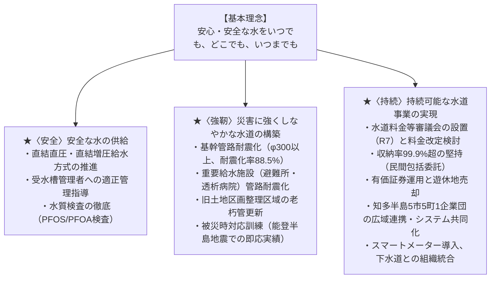

# 半田市水道事業 経営戦略（改定版） 要約解説

本書は、半田市が令和7年12月（2025年12月）に改定した**『半田市水道事業 経営戦略（改定版）』**（計画期間：令和7年度〜令和16年度の10年間）の全32ページの内容を網羅・体系化し、半田市水道事業の現状、抱える課題、投資財政計画、および将来の料金改定シミュレーションの核心が直感的に理解できるようまとめた解説ドキュメントです。

---

## 目次

1. [経営戦略の基本情報と位置づけ](#1-経営戦略の基本情報と位置づけ)
2. [半田市水道事業の概要と施設インフラの特徴](#2-半田市水道事業の概要と施設インフラの特徴)
3. [経営状況の現状分析（経営比較分析表による強みと弱み）](#3-経営状況の現状分析経営比較分析表による強みと弱み)
4. [将来見通し（人口減少・水需要・給水収益の推計）](#4-将来見通し人口減少水需要給水収益の推計)
5. [基本理念と3つの施策目標（安全・強靭・持続）](#5-基本理念と3つの施策目標安全強靭持続)
6. [投資・財政計画と「3つの財政シミュレーション」](#6-投資財政計画と3つの財政シミュレーション)
   - 6-1. 経営基本方針と「内部留保資金13億円」の根拠
   - 6-2. 愛知県営水道料金（受水費）値上げの巨大インパクト
   - 6-3. 財政シミュレーション3ケースの徹底比較（現行・10%改定・20%改定）
   - 6-4. シミュレーション結果のまとめと考察
7. [フォローアップ（PDCAサイクル）](#7-フォローアップpdcaサイクル)
8. [学習・研修・クイズ作問用チェックポイント](#8-学習研修クイズ作問用チェックポイント)

---

## 1. 経営戦略の基本情報と位置づけ

### 計画の基本情報
- **計画名称**：『半田市水道事業 経営戦略（改定版）』
- **策定時期**：令和7年12月（2025年12月）
- **計画期間**：**令和7年度（2025年度）〜令和16年度（2034年度）［10年間］**
- **改定の背景**：令和3年3月に策定した初版「経営戦略」から5年が経過。社会情勢の変化（激甚化する自然災害、能登半島地震の教訓、資材・電気代の高騰、愛知県営水道の受水費値上げ）に対応し、投資計画と財政計画の乖離を検証・改定した。

### 関連計画との役割分担

```
┌─────────────────────────────────────────────────────────────┐
│                 第7次半田市総合計画（最上位計画）             │
└──────────────────────────────┬──────────────────────────────┘
                               │ 整合
┌──────────────────────────────┴──────────────────────────────┐
│           半田市新水道ビジョン（令和3年度〜令和12年度）        │
│       基本理念：「安心・安全な水をいつでも、どこでも、いつまでも」│
└──────────────────────────────┬──────────────────────────────┘
                               │ 具現化
┌──────────────────────────────┴──────────────────────────────┐
│         半田市水道事業経営戦略（改定版）（令和7〜16年度）       │
│     中長期的な投資計画（施設更新・耐震化）と財政見通し（10年間）│
└─────────────────────────────────────────────────────────────┘
```

- **「新水道ビジョン」**：目指すべき将来像と中長期的な事業方針を定める「羅針盤」。
- **「経営戦略」**：ビジョンの施策を実現するために、**「いつ・どこに・いくら投資し、財源をどう手当するか」**を数値で裏付ける10年間の実行計画（総務省通知に基づく公営企業の必須計画）。

---

## 2. 半田市水道事業の概要と施設インフラの特徴

### 2-1. 歴史と最大の事業特性
- **給水開始**：昭和42年（1967年）3月27日
- **最大の事業特性**：**「自己水源・浄水場を一切持たず、愛知県営水道から100%受水している」**
  - 水道水はすべて長良川を水源とする浄水を愛知県営水道から受水して市内に配水しています。
  - そのため、**「県営水道の受水料金（受水費）」の動向が市の水道経営に直結・直撃する**という構造的特徴を持っています。

### 2-2. 3つの受水点と配水系統（災害に強いバックアップ網）
半田市は県営水道から3箇所で受水しており、系統ごとに配水区域が分かれています。

| 配水系統 | 受水点 | 場所 | 計画受水量（日） | 県営水道送水系統 | 主な施設 |
|---|---|---|---:|---|---|
| **砂谷・深谷系統** | **半田第1受水点** | 砂谷配水場内 | 24,600 m³ | 知多浄水場系統（加圧ポンプ） | 砂谷配水池（第1〜第4）、君ヶ橋増圧P場 |
| | **半田第2受水点** | 深谷配水場内 | 16,900 m³ | 常滑広域調整池系統（自然流下） | 深谷配水池（7,000 m³） |
| **北部系統** | **半田第3受水点** | 北部配水場内 | 15,600 m³ | 阿久比広域調整池系統（自然流下） | 北部配水池（第1・第2）、緑ヶ丘・上池増圧P場 |
| **合計** | | | **57,100 m³** | （3系統で相互補完） | |

> [!TIP]
> **全域断水を防ぐリスク分散**  
> 3つの受水点がそれぞれ独立した異なる県営水道系統（加圧系統・自然流下系統）に接続しているため、仮に1つの系統で事故や被災が発生しても、他の受水点から受水を継続でき、**「市全域が一斉に断水する事態」を回避できる運用形態**となっています。

### 2-3. 水道料金の現状：25年間据え置き・県下3番目の安さ
- **料金体系**：口径別の基本料金 ＋ 水量別の従量料金（二部料金制）。
- **改定履歴**：**平成12年（2000年）4月に値下げ改定**を実施して以来、消費税率引き上げ時を除き**約25年間一度も料金を値上げしていません**。
- **水準**：愛知県内の一般家庭平均使用量比較で**「県下で3番目に安い水道料金」**を維持してきました。

---

## 3. 経営状況の現状分析（経営比較分析表による強みと弱み）

全国の類似団体（給水人口規模10万人以上15万人未満の末端給水事業者）との比較（令和5年度実績ベース）から、半田市の際立った強みと深刻な課題が浮き彫りになっています。

### 半田市の主要経営指標一覧（令和5年度実績）

| 指標分類 | 指標名 | 半田市実績 | 類似団体平均 | 評価と分析 |
|---|---|---:|---:|---|
| **経営の健全性・効率性** | **経常収支比率** | **108.99%** | 110.20% | 単年度黒字を維持しているが、近年は低下傾向。 |
| | **累積欠損金比率** | **0.00%** | 0.05% | 過去の赤字の蓄積はゼロ。極めて健全。 |
| | **流動比率** | **369.82%** | 353.13% | 1年以内に返済すべき債務に対して十分な手元資金を保有。 |
| | **企業債残高対給水収益比率** | **29.42%** | **218.57%** | **【圧倒的強み】借金依存度が全国平均の約7分の1！**（※ただし耐震化工事で借入増へ） |
| | **料金回収率** | **101.36%** | 101.78% | 水道料金で給水コストを賄えている（R2・R4の基本料金減免時を除き100%超）。 |
| | **給水原価** | **130.20円** | **163.94円** | **【圧倒的強み】全国平均より約34円/m³も安価！** 自己浄水場を持たず受水管理を徹底。 |
| | **施設利用率** | **75.88%** | 62.35% | 過大施設を持たず、効率的に施設を活用できている。 |
| | **有収率** | **91.83%** | 88.71% | 全国平均より高いが、老朽管漏水や洗管水増で低下傾向。 |
| **老朽化の状況** | **有形固定資産減価償却率** | **51.64%** | 51.95% | 償却資産の半分以上が減価償却済みで、老朽化が着実に進行。 |
| | **管路経年化率** | **24.49%** | **19.51%** | **【深刻な弱み】法定耐用年数（40年）超え管路が全国平均を大きく超過！** |
| | **管路更新率** | **0.58%** | 0.58% | 耐震化工事等で上昇しているが、全管路更新には170年以上かかる計算。 |

### 現状分析のまとめ
- **経営面の強み**：これまでの堅実な経営により企業債（借金）が極めて少なく、低廉な給水原価（130.20円）と高い流動比率（約370%）を誇る優良自治体。
- **インフラ面の弱み**：昭和後期（高度経済成長期〜旧土地区画整理事業期）に一斉に布設された水道管が一斉に耐用年数（40年）を迎え、**管路経年化率（24.49%）が急上昇**している。

---

## 4. 将来見通し（人口減少・水需要・給水収益の推計）

人口減少と節水化の進展により、水道事業の収入の柱である給水収益は下り坂に入ります。

```
【給水人口の推移推計】
  令和3年度： 117,436 人
  令和7年度： 115,105 人
  令和16年度： 111,343 人 （計画10年間で 約3,800人、R3比で約6,100人減少）

【1日平均給水量の推移推計】
  令和3年度： 39,495 m³/日
  令和7年度： 38,111 m³/日
  令和16年度： 36,677 m³/日 （給水人口減と節水機器普及により約7%減少）

【給水収益の将来予測（現行料金のままの場合）】
  令和3年度： 17.6 億円
  令和7年度： 17.4 億円
  令和16年度： 15.9 億円 （約1.5億円の減収）
```

---

## 5. 基本理念と3つの施策目標（安全・強靭・持続）

半田市新水道ビジョンの基本理念**「安心・安全な水をいつでも、どこでも、いつまでも」**を具現化するため、経営戦略では3つの柱で施策を推進します。



### 施策の注目ポイント
1. **直結給水の拡大**：貯水槽方式から「直結直圧・直結増圧給水方式」への切り替えを推進し、フレッシュで安全な水を直接届ける。
2. **耐震化の最優先**：南海トラフ巨大地震に備え、基幹管路（φ300mm以上）や避難所・病院へ至る管路を最優先で耐震化（令和5年度末で基幹管路耐震化率88.5%）。
3. **スマートメーターの導入**：遠隔自動検針により検針困難箇所の解消、集合住宅のメーター交換費用削減、漏水早期発見を実現。
4. **広域連携と組織再編**：愛知県水道広域化推進プランに基づき、同一サーバーでの基幹システム共同化、給排水オンライン連携を進めコスト削減。上水道課と下水道部門の統合・専門技術継承を図る。

---

## 6. 投資・財政計画と「3つの財政シミュレーション」

### 6-1. 経営基本方針と「内部留保資金13億円」の根拠
半田市は健全経営のために次の3つの方針を設定しました。

1. **水道施設の計画的な改築・更新**（耐震化と老朽管更新を最優先）
2. **純利益の確保**（単年度純損益の黒字を継続）
3. **内部留保資金残高「13億円」の確保（最低保有ライン）**

> [!IMPORTANT]
> **なぜ「13億円」を死守しなければならないのか？**  
> 半田市の年間収益的支出は約18億円です。ここから現金支出を伴わない「減価償却費等（約5億円）」を差し引くと、**1年間に実際に動く現金支出は約13億円**となります。  
> 万が一大規模災害が発生して配水管が壊れ、水道料金収入が完全にゼロになったとしても、**最低1年間は自力で事業を継続し、復旧工事代金を支払える手元現金が「13億円」**です。

---

### 6-2. 愛知県営水道料金（受水費）値上げの巨大インパクト
半田市は水作りの100%を県営水道に依存しているため、県営水道の値上げが経営に強烈な打撃を与えます。

- **第1段階値上げ**：令和6年10月に **＋2円/m³** 実施（年間約 **2,800万円** の費用増）
- **第2段階値上げ**：令和8年4月に **＋4円/m³** 決定済（年間約 **8,500万円** の費用増）
- **影響合計**：**年間 約1億1,300万円もの受水費負担増！**

---

### 6-3. 財政シミュレーション3ケースの徹底比較
事業継続に必要な耐震化・老朽管更新投資を計画どおり実行した場合、水道料金の対応によって将来の財政がどうなるかをシミュレーションしています。

#### 比較一覧表（計画最終年度：令和16年度時点の姿）

| 項目 | Case 1：現行料金のまま | Case 2：令和8年度に10%改定 | Case 3：令和8年度に20%改定 |
|---|:---:|:---:|:---:|
| **料金改定率** | **0%（据え置き）** | **＋10%（R8〜）** | **＋20%（R8〜）** |
| **赤字転落年度** | **令和9年度**（早期に赤字） | **令和14年度** | **全期間黒字を維持！** |
| **R16年度 純損益** | **▲2億3,533万円（大赤字）** | **▲7,599万円（赤字）** | **＋8,335万円（黒字）** |
| **13億円割れ年度** | **令和10年度** | **令和12年度** | **令和15年度**（※一時的） |
| **資金ショート時期** | **令和13年度以降（破綻）** | **令和15年度以降（破綻）** | **全試算期間でショート回避！** |
| **R16年度 内部留保残高** | **▲18億1,629万円** | **▲4億3,123万円** | **＋9億5,383万円（残存）** |
| **総合評価** | **事業継続不能（倒産）** | **投資を賄えず破綻** | **唯一、事業継続が可能！** |

---

### 6-4. シミュレーション結果のまとめと考察

```
【Case 1（現行料金）：破綻へのシナリオ】
  給水収益減と受水費値上げにより、わずか2年後の令和9年度に赤字転落。
  老朽管更新工事を継続すると貯金が猛スピードで底をつき、令和10年度に安全ライン（13億円）を突破、
  令和13年度には手元資金が完全になくなり「資金ショート（債務超過・支払い不能）」に陥る。

【Case 2（10%改定）：延命にとどまるシナリオ】
  10%値上げにより令和13年度までは黒字を保てるが、令和14年度には再び赤字へ逆戻り。
  内部留保資金も令和12年度に13億円を割り込み、令和15年度には資金ショート。
  10%程度の改定では、激増する老朽管更新費と県営水受水費を支えきれない。

【Case 3（20%改定）：唯一持続可能なシナリオ】
  令和8年度に20%の改定を実施することで、10年間の計画期間を通じて「毎期純利益（黒字）」を確保。
  内部留保資金残高は一時的に13億円を下回るものの、計画最終年度（令和16年度）でも約9.5億円の資金を維持。
  全期間を通じて資金ショートを完全に回避し、必要な耐震化・老朽管更新を予定通り完遂できる。
```

> [!CAUTION]
> **経営戦略の結論**  
> 半田市が今後、大規模地震に耐えうる管路耐震化を行い、旧土地区画整理区域の老朽管破裂事故を防ぎながら市民に水を届けるためには、**「令和8年度における20%程度の料金改定」が不可避である**という明確な経営判断が示されています。  
> これを受け、市は令和7年度に「水道料金等審議会」を設置し、具体的な料金体系の見直しに着手します。

---

## 7. フォローアップ（PDCAサイクル）

経営戦略は「作って終わり」の計画ではありません。計画と実績の乖離を是正し、経営環境の変化に即応するため、以下のサイクルで進行管理を行います。

- **毎年度の進捗管理（モニタリング）**：事業の進捗状況、純損益、内部留保資金残高、経営指標の実績を毎年度検証。
- **5年ごとの定期更新（ローリング）**：社会経済情勢や水需要の変動を踏まえ、5年ごとに計画全体を見直し（令和7年度策定 → 令和11年度改定 → 令和16年度改定）。

```
令和7年度（策定）
   │
   ├─ 毎年：モニタリング（進捗管理・決算乖離検証）
   │
令和11年度（中間改定：新たな10年計画へローリング）
   │
   ├─ 毎年：モニタリング
   │
令和16年度（第3回改定）
```

---

## 8. 学習・研修・クイズ作問用チェックポイント

本資料からクイズや学習ドリルを作成する際の重要出題ポイントです。

1. **半田市水道事業の最大の特徴は？**
   - 自己水源・浄水場を持たず、愛知県営水道（長良川水源）から100%受水していること。
2. **半田市の水道料金の歴史と県内での水準は？**
   - 平成12年（2000年）に引き下げ改定して以来約25年間据え置きで、愛知県内で3番目に安い水準。
3. **類似団体と比較した半田市の最大の強み指標は？**
   - 企業債残高対給水収益比率（29.42%：全国平均の約7分の1）と給水原価（130.20円：全国平均より約34円安い）。
4. **類似団体と比較した半田市の最大の課題指標は？**
   - 管路経年化率（24.49%：全国平均19.51%を超過し、老朽管が急増している点）。
5. **受水費値上げによる半田市への影響額は？**
   - R6年10月（+2円）で約2,800万円、R8年4月（+4円）で約8,500万円、合計約1.13億円/年のコスト増。
6. **内部留保資金の目標保有額「13億円」の根拠は？**
   - 年間収益的支出（約18億円）から非現金費用の減価償却費等（約5億円）を除いた、年間の実質現金支出額相当。大災害で料金収入が途絶えても1年間自力で事業継続・復旧できる金額。
7. **財政シミュレーションにおける現行料金（Case 1）の結末は？**
   - 令和9年度に赤字転落、令和13年度以降に資金ショート（支払い不能）に陥る。
8. **事業継続と投資を両立できる唯一のシミュレーションケースは？**
   - 令和8年度に20%の料金改定を行う「Case 3」（10年間全期黒字、資金ショート回避）。
