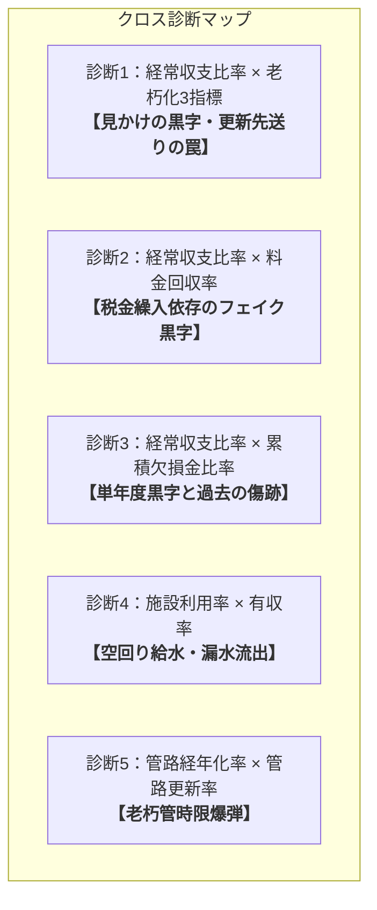

# 経営指標から読み解く水道事業企業会計の仕組み

本書は、総務省公表資料**『経営指標の概要（水道事業）』**に基づき、水道事業特有の企業会計の仕組み、決算書や各種指標の成り立ち、法適用企業と法非適用企業の違い、および複合分析（クロス診断）の手法を、初学者から実務担当者まで直感的に理解できるよう体系的に整理した解説ドキュメントです。

---

## 目次

1. [はじめに：なぜ経営指標から企業会計がわかるのか？](#1-はじめになぜ経営指標から企業会計がわかるのか)
2. [水道事業会計の2大分類（11指標の全体マップ）](#2-水道事業会計の2大分類11指標の全体マップ)
3. [根本構造の違い：「法適用企業」vs「法非適用企業」](#3-根本構造の違い法適用企業vs法非適用企業)
   - 3-1. 複式簿記（発生主義）と単式簿記（現金主義）の決定的差
   - 3-2. 「減価償却費・長期前受金」vs「地方債償還金」の対比
4. [第1部：経営の健全性・効率性を測る8指標の完全解説](#4-第1部経営の健全性効率性を測る8指標の完全解説)
   - ① 経常収支比率（法適用） / 収益的収支比率（法非適用）
   - ② 累積欠損金比率
   - ③ 流動比率
   - ④ 企業債残高対給水収益比率 / 地方債現在高対給水収益比率
   - ⑤ 料金回収率
   - ⑥ 給水原価
   - ⑦ 施設利用率
   - ⑧ 有収率
5. [第2部：インフラ老朽化の危機を測る3指標の完全解説](#5-第2部インフラ老朽化の危機を測る3指標の完全解説)
   - ① 有形固定資産減価償却率
   - ② 管路経年化率
   - ③ 管路更新率（「2.5%＝40年サイクル」の法則）
6. [第3部：指標の組み合わせによる「複合分析（クロス診断）」](#6-第3部指標の組み合わせによる複合分析クロス診断)
   - 診断1：経常収支比率 × 老朽化3指標（「見かけの黒字・更新先送り」の罠）
   - 診断2：経常収支比率 × 累積欠損金比率（単年度黒字と過去の傷跡）
   - 診断3：経常収支比率 × 料金回収率（「税金繰入頼み」の黒字）
   - 診断4：施設利用率 × 有収率（「空回り給水・漏水流出」）
   - 診断5：管路経年化率 × 管路更新率（「老朽管時限爆弾」）
7. [まとめ：水道事業経営を健全に保つための3つの鉄則](#7-まとめ水道事業経営を健全に保つための3つの鉄則)

---

## 1. はじめに：なぜ経営指標から企業会計がわかるのか？

市役所の一般行政（一般会計）は税金を原資に予算を使い切る「現金主義・単式簿記」ですが、水道事業は独立採算制を基本とする「地方公営企業」です。  
企業会計の決算書（貸借対照表 B/S、損益計算書 P/L、キャッシュ・フロー計算書 C/F）には膨大な数字が並びますが、**「それらの数字をギュッと凝縮して経営の急所を可視化したもの」が経営指標**です。

経営指標の計算式や意味を理解することは、**「公営企業会計がどういうルールで動き、どこに経営のリスクが潜んでいるか」**を正確に把握する最短ルートになります。

---

## 2. 水道事業会計の2大分類（11指標の全体マップ）

総務省の『経営比較分析表』では、水道事業の指標を大きく**「１．経営の健全性・効率性」**と**「２．老朽化の状況」**の2つに分類しています。

```
┌─────────────────────────────────────────────────────────────┐
│                 水道事業の主要11経営指標体系                 │
└──────────────────────────────┬──────────────────────────────┘
                               │
       ┌───────────────────────┴───────────────────────┐
       ▼                                               ▼
【1. 経営の健全性・効率性（8指標）】           【2. 老朽化の状況（3指標）】
 ├─ ① 経常収支比率 / 収益的収支比率             ├─ ① 有形固定資産減価償却率
 ├─ ② 累積欠損金比率                            ├─ ② 管路経年化率
 ├─ ③ 流動比率                                  └─ ③ 管路更新率
 ├─ ④ 企業債残高対給水収益比率
 ├─ ⑤ 料金回収率
 ├─ ⑥ 給水原価
 ├─ ⑦ 施設利用率
 └─ ⑧ 有収率
```

- **健全性・効率性**：日々の事業でお金を稼ぎ、借金や支払いを適切にコントロールできているか？（お金・コスト・収益の面）
- **老朽化の状況**：地下の水道管や施設がどれだけ古くなっており、更新投資は追いついているか？（施設・インフラ・資産の面）

水道事業経営の最大の特徴は、**「お金の指標だけが良くても、インフラの指標が悪ければ将来破綻する」**という点にあります。

---

## 3. 根本構造の違い：「法適用企業」vs「法非適用企業」

原典資料の最大の見どころは、すべての指標について**「算出式（法適用企業）」**と**「算出式（法非適用企業）」**が左右に対比されている点です。ここには公営企業会計の本質が凝縮されています。

### 3-1. 複式簿記（発生主義）と単式簿記（現金主義）の決定的差

| 区分 | 法適用企業（企業会計方式） | 法非適用企業（官庁会計方式） |
|---|---|---|
| **対象** | 主に人口規模の大きい市や企業団、移行済みの町 | 主に小規模な町村（順次移行中） |
| **記帳方式** | **発生主義・複式簿記** | **現金主義・単式簿記** |
| **財布の数** | 収益的収支（損益）と資本的収支（投資）を分離 | 歳入・歳出の1つの財布で管理 |
| **減価償却** | **あり**（毎年の価値減少を費用計上） | **なし**（資産の減価という概念がない） |
| **借金返済の扱い** | 利息＝費用、**元金返済＝資本的支出（費用ではない）** | **元金も利息も全額その年の支出（公債費）** |

---

### 3-2. 「減価償却費・長期前受金」vs「地方債償還金」の対比

最も象徴的な違いが、**「⑤ 料金回収率」**と**「⑥ 給水原価」**の計算式です。

```
【法適用企業の経費（給水コスト）の考え方】
  経常費用 － 附帯費用 － 長期前受金戻入
  ※ 経常費用の中には「減価償却費（現金の出ない費用）」が含まれている。
  ※ 国庫補助金等で作った分は「長期前受金戻入」として差し引く。
  ※ 企業債の「元金返済」はここには入らない（4条支出だから）。

【法非適用企業の経費（給水コスト）の考え方】
  総費用 － 受託費 ＋ 地方債償還金（元金返済）
  ※ 減価償却費がないため、代わりに実際に現金が出ていった「地方債の元金返済」を足し合わせる！
```

> [!IMPORTANT]
> **なぜ法非適用では地方債償還金を足すのか？**  
> 施設を作ったときの借金返済（元金）は、将来世代にわたって施設利用料で回収すべきコストです。  
> 法適用企業では「減価償却費」として耐用年数にわたり費用化されますが、減価償却のない法非適用企業では、**「地方債の元金償還金」を費用に上乗せしなければ、本当の給水コストが計算できないから**です。

---

## 4. 第1部：経営の健全性・効率性を測る8指標の完全解説

### ① 経常収支比率（法適用） / 収益的収支比率（法非適用）

$$\text{経常収支比率（％）} = \frac{\text{経常収益}}{\text{経常費用}} \times 100$$
$$\text{収益的収支比率（％）} = \frac{\text{総収益}}{\text{総費用} + \text{地方債償還金}} \times 100$$

- **指標の意味**：その年度の給水収益や繰入金などの収益で、維持管理費や支払利息などの経常費用をどの程度賄えているかを表す指標。
- **合格ライン**：**100%以上が必須**（100%未満は単年度赤字）。
- **分析のポイント**：100%以上で黒字であっても、「将来の老朽管更新投資に回す貯金（内部留保資金）」が十分に蓄えられているかを分析する必要がある。

---

### ② 累積欠損金比率

$$\text{累積欠損金比率（％）} = \frac{\text{累積欠損金}}{\text{営業収益} - \text{受託工事収益}} \times 100$$
（※法適用企業のみ算出。法非適用企業には「欠損金」という勘定が存在しないため対象外）

- **指標の意味**：過去の赤字の累積（累積欠損金）が、年間の営業収益の何倍に達しているかを表す指標。
- **合格ライン**：**0%（欠損金なし）が理想**。
- **分析のポイント**：たとえ単年度の経常収支比率が100%を超えて黒字化していても、累積欠損金比率が高い団体は、過去の巨額な赤字を背負ったままの「債務超過予備軍」であり、早急な解消計画が必要。

---

### ③ 流動比率

$$\text{流動比率（％）} = \frac{\text{流動資産}}{\text{流動負債}} \times 100$$
（※貸借対照表 B/S を作成する法適用企業のみ算出）

- **指標の意味**：1年以内に支払期限が到来する債務（流動負債）に対し、1年以内に現金化できる資産（流動資産＝現金預金・未収金等）がどれだけあるかを示す**「短期的な資金繰り・支払能力」**の指標。
- **合格ライン**：**100%以上が絶対条件**（一般企業では150〜200%以上が安全圏）。
- **分析のポイント**：
  - 100%を下回る場合は、手元資金ショート（不渡り・債務不履行）の危機にある。
  - **100%以上であっても、現金が減少し一時借入金（短期借金）が増えている場合は資金繰りが急激に悪化している兆候**なので注意が必要。

---

### ④ 企業債残高対給水収益比率 / 地方債現在高対給水収益比率

$$\text{企業債残高対給水収益比率（％）} = \frac{\text{企業債現在高}}{\text{給水収益}} \times 100$$

- **指標の意味**：年間の水道料金収入（給水収益）に対して、抱えている長期借入金（企業債残高）が何％（何年分）に達しているかを示す指標。
- **分析のポイント**：
  - 数値が高いほど、将来の元利償還金の支払負担が重く、経営を圧迫する（全国類似団体平均は200%前後＝年収の2年分程度の借金）。
  - ただし、**「数値が極端に低い＝無借金だから常に良い」とは限らない**。必要な管路耐震化や老朽化対策を全く行わずに放置している結果、借入がないだけのケースもあるため、老朽化指標とセットで見る。

---

### ⑤ 料金回収率

$$\text{料金回収率（法適用・％）} = \frac{\text{給水収益}}{\text{経常費用} - (\text{受託工事費} + \text{材料不用品売却原価} + \text{附帯事業費}) - \text{長期前受金戻入}} \times 100$$
$$\text{料金回収率（法非適用・％）} = \frac{\text{給水収益}}{\text{総費用} - \text{受託工事費} + \text{地方債償還金}} \times 100$$

- **指標の意味**：水を作る・送るためにかかった実質的な給水コストを、市民からいただく水道料金（給水収益）だけでどれだけ回収できているかを示す**「受益者負担の原則の達成度」**。
- **合格ライン**：**100%以上が原則**。
- **分析のポイント**：
  - **経常収支比率が100%以上でも、料金回収率が100%未満のケース**：
    水道料金ではコストを賄えておらず、**一般会計からの税金繰入金や他会計補助金で穴埋めして「みかけの黒字」を作っている**ことを意味する。本来の独立採算制が成り立っておらず、料金改定の検討が必要。

---

### ⑥ 給水原価

$$\text{給水原価（法適用・円）} = \frac{\text{経常費用} - (\text{受託工事費} + \dots) - \text{長期前受金戻入}}{\text{年間総有収水量（m³）}}$$

- **指標の意味**：蛇口まで届けた**水1m³を供給するために、何円のコストがかかったか**を表す単価指標。
- **分析のポイント**：
  - 明確な全国一律基準はないが、経年比較や類似団体との比較で自事業体のコスト競争力を測る。
  - 給水原価が高い場合の内訳分析：受水費（県からの買水）、動力費（電気代）、修繕費、人件費、減価償却費のどこに割高要因があるかを特定して対策を打つ。
  - **供給単価（給水収益 ÷ 有収水量）と比較し、供給単価 ＜ 給水原価 であれば「逆ざや（売れば売るほど赤字）」**状態。

---

### ⑦ 施設利用率

$$\text{施設利用率（％）} = \frac{\text{一日平均給水量}}{\text{施設能力（一日最大給水量能力）}} \times 100$$

- **指標の意味**：保有している浄水場や配水池などの設備能力に対し、平均してどれだけの水を作って稼働させているか（設備の有効稼働度）。
- **分析のポイント**：
  - 数値が低い（例：40〜50%以下）場合、人口増加期に過大投資した「過大施設・オーバースペック」となっており、遊休化した施設の維持費や減価償却費が無駄に経営を圧迫している。
  - 逆に高すぎる場合も、真夏のピーク需要（一日最大給水量）や災害時に耐えられるか、最大稼働率や負荷率を併せて診断し、将来の人口減少に合わせた**ダウンサイジング（減容化）や広域化・施設統廃合**を検討する。

---

### ⑧ 有収率

$$\text{有収率（％）} = \frac{\text{年間総有収水量（料金を請求できた水量）}}{\text{年間総配水量（浄水場から送り出した全水量）}} \times 100$$

- **指標の意味**：水道管に送り出した水のうち、**途中で消えずにちゃんと料金メーターで計量され、売上につながった水の割合**。
- **分析のポイント**：
  - **100%に近いほど優秀**（日本の優秀な水道事業体は90〜95%以上）。
  - 有収率が低い（例：80%未満）場合、差の10〜20%以上の水は**「道路下の老朽管から漏水して土の中に消えている」**か、メーターの不感（故障）でタダで使われていることを意味する。
  - 漏水防止対策（音聴調査、老朽管布設替）を打つことで、無駄な浄水コスト・受水費を大幅に削減できる。

---

## 5. 第2部：インフラ老朽化の危機を測る3指標の完全解説

水道事業は設備産業です。決算書が黒字でも、地下の管路がボロボロであれば近い将来に大規模断水や道路陥没事故を引き起こし、更新費用の急増で財政破綻します。

### ① 有形固定資産減価償却率

$$\text{有形固定資産減価償却率（法適用・％）} = \frac{\text{有形固定資産減価償却累計額}}{\text{有形固定資産のうち償却対象資産の帳簿原価}} \times 100$$
（※法適用企業のみ算出）

- **指標の意味**：保有しているすべての水道施設・管路・機器について、法定耐用年数のうち**すでにどれくらいの割合を使い切って減価償却が進んだか（資産全体の老朽化度合）**を示す。
- **分析のポイント**：
  - 数値が50%〜60%を超えて上昇し続けている場合、資産の寿命が間近に迫っていることを示し、近い将来に設備更新投資のピークが一斉に到来することを予告する。

---

### ② 管路経年化率

$$\text{管路経年化率（％）} = \frac{\text{法定耐用年数（40年）を経過した管路延長}}{\text{全管路延長}} \times 100$$

- **指標の意味**：道路下に埋まっている水道管のうち、**法定耐用年数である「40年」を超えて使われ続けている老朽管の割合**。
- **分析のポイント**：
  - 高度経済成長期（昭和40〜50年代）に埋めた管が全国で一斉に40年を超えており、全国平均は約20%に達し、自治体によっては30〜40%を超える。
  - 数値が高いほど、道路下での漏水・管破裂事故、濁水・赤水発生、大規模地震時の壊滅的被災リスクが跳ね上がる。

---

### ③ 管路更新率（「2.5%＝40年サイクル」の法則）

$$\text{管路更新率（％）} = \frac{\text{当該年度に新しく更新・布設替えした管路延長}}{\text{全管路延長}} \times 100$$

- **指標の意味**：1年間に、全体の何パーセントの水道管を新しい耐震管に更新できたかという**「更新ペース」**を表す。

```
【超重要：「2.5%」の法則】
  100% ÷ 40年 ＝ 毎年 2.5%

  すべての管路を法定耐用年数（40年）のサイクルで計画的に更新し続けるためには、
  毎年「2.5%」ずつ更新しなければならない！
```

- **日本の冷酷な現実**：
  全国の水道事業体の平均管路更新率はわずか**「0.5%〜0.7%前後」**にとどまっています。  
  年0.5%の更新ペースということは、**すべての管を1回新しくするのに「200年」かかる**計算になり、老朽化のスピード（毎年1年ずつ歳をとる）に更新が全く追いついていません。

---

## 6. 第3部：指標の組み合わせによる「複合分析（クロス診断）」

原典資料の末尾（P5）には、単一の指標を見るだけでは見落としてしまう経営の罠を見抜く**「各指標の組み合わせによる分析の考え方（クロス診断）」**が5つ提示されています。公営企業会計の実務において最も重要な実践スキルです。



---

### 診断1：経常収支比率 × 老朽化3指標（「見かけの黒字・更新先送り」の罠）
- **組み合わせ**：
  - 経常収支比率（高・良好）
  - 有形固定資産減価償却率（高・老朽化）
  - 管路経年化率（高・老朽化）
  - 管路更新率（低・停滞）
- **診断結果**：**「必要な更新投資をサボることで生み出された“見せかけの黒字”」**
- **解説**：
  更新工事を行わなければ、工事に伴う起債利息や減価償却費が増えず、当面の帳簿上の支出は抑えられるため経常収支比率は高く（黒字に）見えます。しかし、地下では老朽管が限界を迎えており、将来世代に巨額の更新ツケと断水リスクを先送りしている極めて危険な状態です。

---

### 診断2：経常収支比率 × 料金回収率（「税金繰入頼み」の黒字）
- **組み合わせ**：
  - 経常収支比率（100%以上・黒字）
  - 料金回収率（100%未満・原価割れ）
- **診断結果**：**「一般会計の税金に寄生した赤字体質の水道」**
- **解説**：
  水道料金収入だけでは水を作るコストを賄えておらず、一般会計（市役所本体）からの繰入金（税金補填）でかろうじて黒字を取り繕っています。「受益者負担の原則」が崩壊しており、税金の投入をやめれば即座に大赤字に転落するため、早急な水道料金改定が必要です。

---

### 診断3：経常収支比率 × 累積欠損金比率（単年度黒字と過去の傷跡）
- **組み合わせ**：
  - 経常収支比率（100%以上・単年度黒字）
  - 累積欠損金比率（高・多額の累積赤字）
- **診断結果**：**「過去の傷が癒えていない病み上がりの経営」**
- **解説**：
  今年度の決算は黒字でも、過去から積み上がった欠損金の山が消えていません。不測の事態（災害や大規模漏水）が起きれば一瞬で資金ショートに陥るリスクがあり、引き続き徹底した経営改善と欠損金の解消が必要です。

---

### 診断4：施設利用率 × 有収率（「空回り給水・漏水流出」）
- **組み合わせ**：
  - 施設利用率（高・フル稼働）
  - 有収率（低・売上にならない）
- **診断結果**：**「作った水が道路下でダダ漏れしている空回り経営」**
- **解説**：
  浄水場やポンプはフル稼働して水をたくさん送り出しているのに、有収率が低いため料金収入に結びついていません。電気代や薬品費、県からの受水費を大量に使って「土の中に水を捨てている」状態です。施設を増やすのではなく、管路の漏水調査と修繕が最優先の処方箋です。

---

### 診断5：管路経年化率 × 管路更新率（「老朽管時限爆弾」）
- **組み合わせ**：
  - 管路経年化率（高・老朽管だらけ）
  - 管路更新率（低・更新が遅い）
- **診断結果**：**「爆発寸前の老朽管時限爆弾」**
- **解説**：
  40年を超えた管路が年々増え続けているのに、年間の更新ペースが追いついていません。道路陥没や大震災時の断水被害が確実に現実化するため、早急に投資計画を見直し、起債や料金改定を行って更新ペースを引き上げる必要があります。

---

## 7. まとめ：水道事業経営を健全に保つための3つの鉄則

1. **損益計算書（P/L）の黒字だけに惑わされない**
   - 経常収支比率だけでなく、料金回収率（税金頼みではないか？）と内部留保資金（手元現金はあるか？）を必ずセットで確認する。
2. **インフラの老朽化ペースに投資を追いつかせる**
   - 経年化率の上昇を放置せず、管路更新率を計画的な水準（2%前後のサイクル）へ近づける投資財政計画を組む。
3. **法適用の複式簿記・企業会計を「経営の操縦桿」として使いこなす**
   - 減価償却費、長期前受金戻入、補てん財源、そして11の経営指標を活用し、客観的なデータに基づき住民に料金改定の必要性を説明・理解してもらう。
