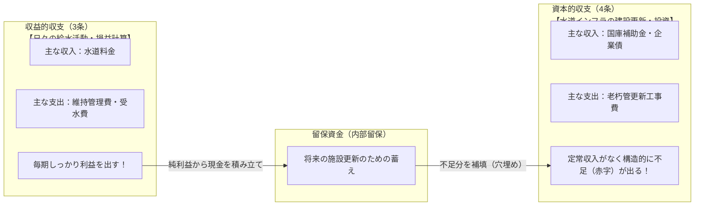
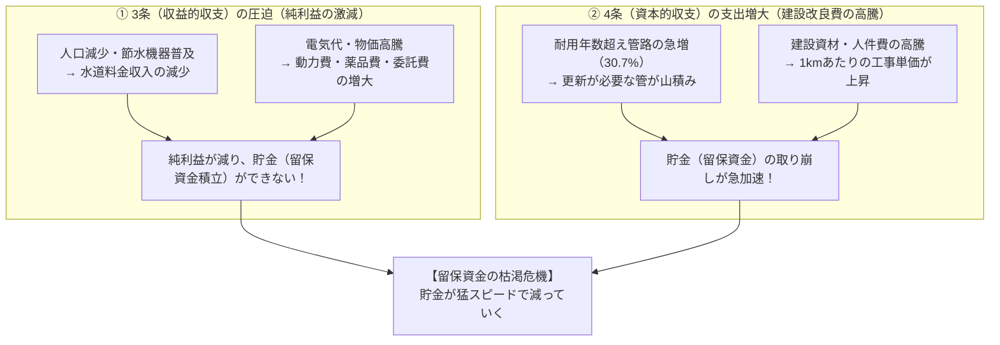

# 『誰でもわかる水道事業会計』完全解説まとめ

本書は、愛知中部水道企業団が発行した住民・初学者向け広報資料『誰でもわかる水道事業会計』（令和4年度決算ベース）の内容を、水道事業に関わるすべての人が本質を直感的に理解できるよう再構成・体系化した解説ドキュメントです。

---

## 目次

1. [水道事業会計の超基本：「独立採算制」とは](#1-水道事業会計の超基本独立採算制とは)
2. [2つの財布と2人のキャラクター（収益的収支と資本的収支）](#2-2つの財布と2人のキャラクター収益的収支と資本的収支)
3. [日々の運営を支える「収益的収支」（3条予算）](#3-日々の運営を支える収益的収支3条予算)
4. [お金が減らない支出「減価償却費」のカラクリ](#4-お金が減らない支出減価償却費のカラクリ)
5. [お金が増えない収入「長期前受金戻入」のカラクリ](#5-お金が増えない収入長期前受金戻入のカラクリ)
6. [施設の更新・整備を担う「資本的収支」（4条予算）](#6-施設の更新整備を担う資本的収支4条予算)
7. [将来のための貯金「留保資金」と現金の計算フロー](#7-将来のための貯金留保資金と現金の計算フロー)
8. [今後の水道経営が直面する危機と課題](#8-今後の水道経営が直面する危機と課題)
9. [学習・研修用チェックポイント＆一問一答](#9-学習研修用チェックポイント一問一答)

---

## 1. 水道事業会計の超基本：「独立採算制」とは

一般の市役所や町村役場の仕事（道路、福祉、教育など）は、市民から集めた「税金」で運営されています（**一般会計**）。  
しかし、水道事業は法律（**地方公営企業法**）に基づき、税金ではなく**「水道料金」の収入だけで経営にかかるすべての費用をまかなう**ことが原則となっています。

これを**独立採算制（どくりつさいさんせい）**と呼びます。

```
【一般行政（一般会計）】
　税金を集める ───> 道路整備、福祉、公園、教育、警察・消防などの公共サービスを提供

【水道事業（公営企業会計）】
　水道料金をいただく ───> 安全で清潔な水を24時間365日蛇口までお届けする（独立採算）
```

> [!NOTE]
> **なぜ税金ではなく料金なのか？**  
> 水道水は使った人（受益者）が特定できるため、「使った分だけその人が費用を負担する（**受益者負担の原則**）」が公平だからです。

---

## 2. 2つの財布（第3条：収益的収支 と 第4条：資本的収支）

水道事業の会計最大の特徴は、財布が**「収益的収支（3条）」**と**「資本的収支（4条）」**の2つに完全に分かれている点です。  
この2つは「日々の給水活動に伴う損益」と「将来の施設更新に伴う投資」として明確に役割分担し、相互に補完し合っています。



### 3条と4条の役割比較

| 項目 | 収益的収支（第3条） | 資本的収支（第4条） |
|---|---|---|
| **主な目的** | 日々の給水事業を運営し、利益を出して**資金を蓄える**こと | 古くなった水道管や施設を**工事・更新する**こと |
| **主な収入** | 水道料金、長期前受金戻入 | 国からの借入金（企業債）、補助金 |
| **主な支出** | 受水費（水を買うお金）、維持管理費、減価償却費、人件費 | 水道管の更新工事費、借入金の元金返済 |
| **特徴** | 自分で水道管の工事は直接行わない。4条の投資のために黒字を出して留保資金を作る！ | 水道料金のような定常収入がないのに工事費が莫大。**必ず毎年資金不足が発生**するため、3条の留保資金で補填する！ |

### なぜ2つの財布を分けるのか？
工事費などの莫大な支出を日々の運営費（収益的収支）に一緒に入れてしまうと、**「その1年間の経営が黒字だったのか赤字だったのか」**が正しく分からなくなってしまいます。

- **収益的収支（1年限りの消費）**：その年の水を作る・配るために「使って消えてしまった」費用。
- **資本的収支（将来への投資）**：何十年にもわたって市民の生活を支え続ける「水道管や浄水場という固定資産」を作るための投資。

そのため、公営企業会計では2つの取引を厳格に分けて記録します。

---

## 3. 日々の運営を支える「収益的収支」（3条予算）

水道水を蛇口まで安全に届けるための日常的な取引です。

### 令和4年度決算の内訳（愛知中部水道企業団の実績例・税抜）

```
【収入】 合計 70.8 億円
├─ 水道料金収入 ──────── 58.9 億円 （全体の約83%）
├─ 長期前受金戻入 ★ ─────  8.7 億円 （お金が増えない収入）
└─ その他 ──────────────  3.2 億円

【支出】 合計 60.4 億円
├─ 水を買う費用（受水費） ── 21.8 億円 （愛知県企業庁等からの受水）
├─ 減価償却費など ★ ──── 20.7 億円 （お金が減らない支出）
├─ 水道施設維持費用など ─── 12.4 億円 （修繕費、薬品費、動力費など）
├─ 人件費 ──────────────  5.2 億円 （職員給与など）
└─ 借入金支払利息 ────────  0.3 億円

【差引（損益）】
  収入 70.8億円 － 支出 60.4億円 ＝ 純利益 ＋10.4 億円
```

### 超重要ポイント：純利益 ＝ 手元の現金 ではない！
一見すると「10.4億円も儲かったから、10.4億円丸ごと貯金できる！」と思いがちです。  
しかし、ここには**「実際には現金が動いていない項目」**が含まれています。

1. **支出の中の「減価償却費」**（20.7億円） ── **お金が出ていかない**
2. **収入の中の「長期前受金戻入」**（8.7億円） ── **お金が入ってこない**

この2つを正しく理解することが、企業会計マスターへの最大の鍵です。

---

## 4. お金が減らない支出「減価償却費」のカラクリ

水道管や施設は、一度建設すれば30年〜40年以上使えます。  
これを建設した年だけに全額費用として計上すると、その年だけ超巨大な大赤字になり、翌年以降はタダで使っていることになってしまいます。

そこで、**「使った年数に応じて、減った価値の分だけ少しずつ費用にする」**仕組みが**減価償却（げんかしょうきゃく）**です。

### 具体例：4,000万円で水道管を布設した場合（耐用年数40年）

```
【建設時】
  4,000万円を支払って水道管を布設（手元から4,000万円の現金が支出され、資産になる）。

【毎年の決算（耐用年数40年間）】
  4,000万円 ÷ 40年 ＝ 毎年 100万円 ずつ「減価償却費」として費用計上。

  1年後：水道管の資産価値 3,900万円 ｜ 費用 100万円
  2年後：水道管の資産価値 3,800万円 ｜ 費用 100万円
  3年後：水道管の資産価値 3,700万円 ｜ 費用 100万円
    ：
  40年後：水道管の資産価値 0円（※備忘価額）｜ 累積費用 4,000万円
```

> [!IMPORTANT]
> **ここがポイント！**  
> 毎年計上される「減価償却費100万円」は、帳簿上のルールで費用にしているだけで、**誰かの銀行口座に100万円を振り込んでいるわけではありません。**  
> つまり、**「費用（支出）として計算されているのに、手元の現金は1円も減っていない」**のです。

---

## 5. お金が増えない収入「長期前受金戻入」のカラクリ

減価償却費の「逆の現象」が、**長期前受金戻入（ちょうきまえうけきんれいにゅう）**です。

水道管を作るとき、国などから**「補助金」**をもらうことがあります。  
この補助金も、もらった年に一括で「利益（収入）」にしてしまうと、その年だけ不自然に大黒字になってしまいます。  
そのため、**補助金も水道管の耐用年数に合わせて、毎年少しずつ収入に振り替えていきます。**

### 具体例：4,000万円の管布設で、国から400万円の補助金をもらった場合

```
【建設時】
  国から補助金400万円を受領（手元に400万円の現金が入る）。
  会計上は「長期前受金（負債）」としてプールしておく。

【毎年の決算（耐用年数40年間）】
  400万円 ÷ 40年 ＝ 毎年 10万円 ずつ「長期前受金戻入」として収入計上。

  1年後：収入 10万円 （※現金が入るわけではない）
  2年後：収入 10万円
  3年後：収入 10万円
    ：
  40年後：合計 400万円 の収入計上が完了
```

> [!IMPORTANT]
> **ここがポイント！**  
> 毎年の「長期前受金戻入10万円」は、過去にもらった補助金を帳簿上で少しずつ収入として切り崩しているだけです。  
> つまり、**「収入として計上されているのに、今年新たに手元に入る現金は1円もない」**のです。

---

## 6. 施設の更新・整備を担う「資本的収支」（4条予算）

水道管の耐震化工事や、老朽化した浄水場・配水場の更新工事を行うための財布です。

### 令和4年度決算の内訳（愛知中部水道企業団の実績例・税込）

```
【収入】 合計 12.8 億円
├─ 国等からの借入金（企業債） ── 7.0 億円
└─ 国庫補助金・その他 ───────── 5.8 億円

【支出】 合計 37.4 億円
├─ 水道施設の建設・更新工事費 ── 34.5 億円 （老朽管更新、耐震化など）
└─ 過去の借入金の元金返済・他 ──  2.9 億円

【差引（不足額）】
  収入 12.8億円 － 支出 37.4億円 ＝ 不足額 ▲24.6 億円
```

### なぜ資本的収支は「必ず赤字（不足）」になるのか？
「24.6億円の大赤字！ 水道事業は破綻寸前なのか！？」と驚くかもしれませんが、**これは公営企業会計としてごく正常な状態**です。

- **理由**：資本的収入には「水道料金」のような毎月入る巨大な収入がありません。収入は補助金や借金（企業債）に限られます。
- **不足の穴埋め**：この▲24.6億円の不足額は、過去から貯めてきた**「留保資金（貯金）」を取り崩して補填**します。

---

## 7. 将来のための貯金「留保資金」と現金の計算フロー

「収益的収支（3条）」が生み出した資金（純利益＋減価償却費）から、「資本的収支（4条）」の工事代や元金償還の不足分をどうやって補填するのか、その現金（キャッシュ）の流れを整理します。

### 純利益と現金のズレを調整する式（令和4年度決算）

資料P7・P8の解説に基づく、留保資金（現金残高）の増減計算：

| 項目 | 金額 | 現金の動きと理由 |
|---|---:|---|
| **① 収益的収支の純利益** | **+10.4 億円** | 帳簿上の利益（ここからスタート） |
| **② お金が減らない支出（減価償却費等）** | **+20.7 億円** | 費用計上したが実際には現金が手元に残っているので**足し戻す** |
| **③ お金が増えない収入（長期前受金戻入）** | **▲8.7 億円** | 収入計上したが現金は入ってこないため**差し引く** |
| **＝ 収益的収支で実際に生み出された現金** | **+22.4 億円** | （10.4 ＋ 20.7 － 8.7 ＝ 22.4億円）※概算 |
| **④ 資本的収支の不足額** | **▲24.6 億円** | 施設更新工事や借金返済で実際に出ていったお金 |
| **⑤ その他（消費税等調整）** | **+2.4 億円** | 税込・税抜の消費税精算に伴う調整 |
| **【最終結果】留保資金（貯金）の増減** | **+0.2 億円** | **前年度より 0.2億円の微増にとどまる** |

```
【現金の流れまとめ】
純利益 10.4億円 が出たからといって、10.4億円の貯金が増えるわけではない！
減価償却費や長期前受金を調整し、資本的収支の不足分（▲24.6億円）を穴埋めした結果、
手元に残った貯金（留保資金）の増加はわずか「0.2億円」だった。
```

---

## 8. 今後の水道経営が直面する危機と課題

資料の後半（P9〜P10）では、現在の水道事業が置かれている非常に厳しい現実が警鐘として鳴らされています。

### 1. 水道管の急激な老朽化
愛知中部水道企業団の管路延長は約1,856km。高度経済成長期（昭和50年前後）に布設された管が一斉に寿命を迎えています。

- **法定耐用年数（40年）を超えた管の割合**：
  - 平成25年度（2013年）：**11.7%**
  - 令和4年度（2022年）：**30.7%**（わずか10年で **+19.0%** も急上昇！）
- **放置した場合のリスク**：道路下での漏水・破裂事故、断水、赤水・濁り水による市民生活や病院・学校への甚大な被害。

### 2. 水道事業を襲う「三重苦」



### 3. 最低限守るべきライン「災害対策用 15億円」
愛知中部水道企業団では、**「手元の貯金として最低15億円は絶対に維持する」**という防衛ラインを設定しています。

> [!CAUTION]
> **なぜ15億円が必要なのか？**  
> 南海トラフ巨大地震などの大災害が発生すると、水道管が広範囲で破損し、水道料金の徴収もストップ（収入ゼロ）します。  
> その極限状態でも、全国からの応援部隊や工事業者に緊急復旧工事を発注し、**工事代金を即座に支払える手元現金がなければ、市民の命の水を復旧させることができない**からです。

### 4. 解決に向けた3つの対策
1. **効率的・効果的な更新工事**：重要給水施設（病院・避難所）へ向かう管を優先し、新技術・工法でコストを圧縮する。
2. **経営状況の徹底的な把握・分析**：無駄な支出を徹底的に削る（経費削減努力）。
3. **水道料金改定の検討**：どうしても独立採算が維持できなくなる前に、計画的な料金適正化を住民に説明し理解を得る。

---

## 9. 学習・研修用チェックポイント＆一問一答

水道事業会計の理解度を確認するための重要ポイント集です。

### Q1. なぜ水道事業には税金が投入されず、水道料金だけで運営するのですか？
**A.** 地方公営企業法により「独立採算制」が定められているからです。水を使った人が使った分だけ公平に費用を負担する「受益者負担の原則」に基づいています。

### Q2. 収益的収支と資本的収支の一番の違いは何ですか？
**A.** 
- **収益的収支（3条）**：その1年間の水の供給に必要な「日々の運営取引（使って消える費用と水道料金収入）」
- **資本的収支（4条）**：何十年も使い続ける「水道施設の整備・更新取引（将来への投資と借入・返済）」

### Q3. 「資本的収支が毎年マイナス（大赤字）」なのは、経営破綻のサインですか？
**A.** いいえ、正常な状態です。資本的収支には水道料金のような定常収入がないため、必ず支出（工事費等）が収入（補助金・借入）を上回ります。この不足額は、収益的収支で稼いで貯めておいた「留保資金」で補填します。

### Q4. 減価償却費が「お金の減らない支出」と呼ばれるのはなぜですか？
**A.** 施設建設時に全額のお金を支払っており、毎年の減価償却費は「帳簿上で価値が減った分を費用として記録しているだけ」だからです。実際には誰にも現金を支払っていません。

### Q5. 長期前受金戻入が「お金の増えない収入」と呼ばれるのはなぜですか？
**A.** 過去に施設を作った際にもらった補助金を、耐用年数に合わせて毎年の帳簿上に少しずつ「収入」として振り替えているだけだからです。今年新たに現金が振り込まれているわけではありません。

### Q6. 純利益が10億円出ているのに、なぜ水道料金の値上げを検討しなければならないのですか？
**A.** 純利益のすべてが現金ではなく（減価償却費と長期前受金のズレ）、さらに老朽化した水道管の更新工事に毎年莫大な現金（資本的支出の不足分）が消えていくためです。貯金（留保資金）が急激に減り、災害復旧に必要な最低保有資金（15億円）を割り込む恐れがあるためです。

---

## まとめ図：水道事業会計の全体構造マップ

```
┌─────────────────────────────────────────────────────────────┐
│                      水道事業企業会計                       │
│              （独立採算制：税金ではなく水道料金）            │
└──────────────────────────────┬──────────────────────────────┘
                               │
               ┌───────────────┴───────────────┐
               ▼                               ▼
    【収益的収支（3条予算）】       【資本的収支（4条予算）】
     日々の運営（日常の給水活動）     施設整備・更新（インフラ投資）
   ┌───────────────────────┐       ┌───────────────────────┐
   │［収入］               │       │［収入］               │
   │・水道料金収入         │       │・国庫補助金           │
   │・長期前受金戻入(非現金)│      │・企業債（借入金）     │
   │                       │       │                       │
   │［支出］               │       │［支出］               │
   │・受水費（県からの水） │       │・管路更新工事費       │
   │・維持管理費・人件費   │       │・企業債の元金返済     │
   │・減価償却費  (非現金) │       │                       │
   └───────────┬───────────┘       └───────────▲───────────┘
               │                               │
           純利益発生                      必ず不足発生
               │                               │
               ▼                               │
      ┌──────────────────────────────────┐     │
      │        留保資金（貯金）          ├─────┘
      │ ・現金を積み立て                 │ (不足分を補填)
      │ ・大災害への備え（最低15億円死守）│
      └──────────────────────────────────┘
```
