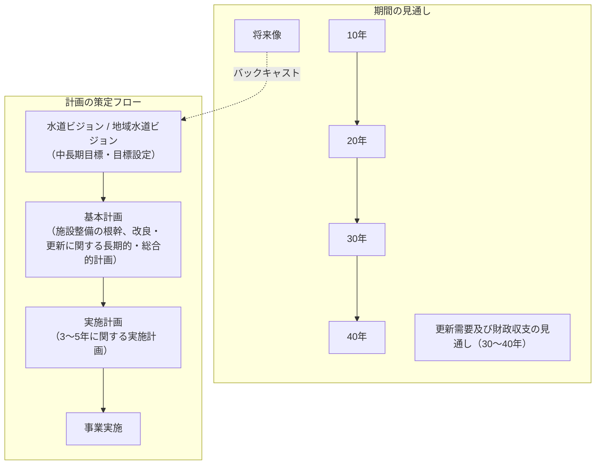
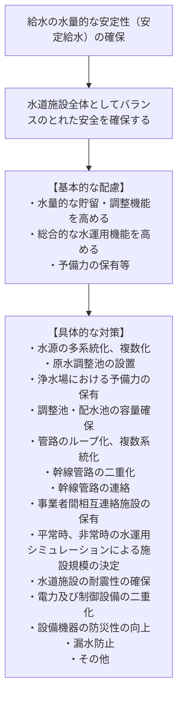

# 水道施設整備・設計指針 1.2 基本計画（配慮事項・安定給水・水源施設）

> 出典・参照：水道施設設計指針 第1章 1.2 基本計画（p.8〜9）  
> 主な内容：基本計画策定における6つの配慮事項、アセットマネジメントと各種計画の関係（図-1.2.1）、水量的な安全性（安定給水）の確保と手順（図-1.2.2）、水源および貯水施設、水資源開発基本計画（フルプラン7水系・参考-1.2）

---

## 1.2 基本計画（前ページ p.7 からの続き）

基本計画を策定するにあたっては、次の事項に配慮する。

1. **水量的な安全性の確保**
2. **水質的な安全性の確保**
3. **適正な水圧の確保**
4. **災害・事故対策**
5. **施設の改良・更新**
6. **環境への配慮**

---

### 【解説】
水道事業は、少子化の進行などによる人口の減少とそれに伴う水需要や料金収入の減少等が懸念されている。このため、的確な将来予測のもと、地域の将来動向に見合った施設規模の適正化や再構築、また、広域化による施設整備・管理の効率化や、官民連携による様々な事業形態を想定した施設整備についても検討する必要がある。

施設整備は新設・拡張の時代から、改良・更新の時代に移行してきている。加えて我が国は地震国であるため、施設の耐震化の推進が強く求められるとともに、豪雨・渇水・土砂災害・その他自然事象に備えた整備を進めなければならない。また、省エネルギー化などの脱炭素に視点をおいた取組も重要である。

基本計画は、水道施設の整備等の根幹となる長期的かつ総合的な計画であり、これらの諸条件に合致する内容とする必要がある。

そのためには、「アセットマネジメントに関する手引き」に示される考え方や検討手法等を活用して更新需要と財政収支見通しを把握する。その結果を地域水道ビジョン等に反映させ、同時に中長期の目標を立て、基本計画、各事業の実施計画を策定し、計画的に施設整備を行うことが重要となる。ちなみに基本計画は、地域水道ビジョンのうち施設整備等の具体的な内容を示すものとなる（図-1.2.1参照）。

なお、基本計画のうち現状の分析と評価および設定については、可能な限り定量的な表現ですることに留意し、業務指標（PI）や、アセットマネジメントの考え方を有効に活用する。

---

### 図-1.2.1 アセットマネジメントと基本計画等の各種計画との関係
*(厚生労働省：水道事業におけるアセットマネジメント（資産管理）に関する手引きを元に作成)*

#### 【各種計画の位置づけと時間軸】
* **見通し（30〜40年）**: アセットマネジメントによる長期的な更新需要及び財政収支の見通しを把握。
* **将来像からのバックキャスト**: 将来像を設定し、バックキャストして中長期の目標（地域水道ビジョン）を策定。
* **基本計画**: 施設整備等の根幹に関する長期的・総合的な計画（ビジョンの施設整備内容を具体化）。
* **実施計画（3〜5年）**: 基本計画を踏まえた直近数年間の具体的事業計画。
* **事業実施**: 計画的な改良・更新工事の推進。

---

### 1. 水量的な安全性の確保について
水道は、平常時の水需要に対応した給水はもとより、地震・風水害・渇水等の災害時および事故等の非常時においても、住民の生活に著しい支障をきたすことがないよう、水源の安定確保をはじめ給水までを通して、水道施設全体としてバランスのとれた適切な安全性を確保する必要がある（図-1.2.2参照）。

具体的には、水源の多系統化、原水調整池の設置、浄水場予備力の保有、配水池の容量確保と適正配置、管路のループ化や複数系統化、基幹管路の連絡、事業者間の相互融通等を考慮するとともに、平常時および非常時の水運用シミュレーションを実施し、必要な配水池等の容量、管路の口径およびポンプ容量等を決定する。

このほか、計画取水量、計画浄水量、計画配水量などの決定にあたっては、それぞれの水道施設の能力により、平常時だけでなく非常時の水運用を踏まえた効率的な安全性を見込み、併せて、これに見合った経済性を確保する必要がある。

給水の安定性確保は基本的な要件であるが、これに必要な対策は自然的条件、社会的条件等とも密接な関連を有するため、安定給水対策の選択は一律に定めるものではなく、各水道事業等の諸条件や財政状況等に適合したものとする必要がある。

個々の施設について水量的な安全性を高めるための留意点を述べると、次のとおりである。

---

### 図-1.2.2 安定給水確保のための基本手順

*(注：安定給水対策は、一律なものではなく、各水道事業の諸条件等に適合したものを選択する。)*

---

## 個別施設における水量的安全性の確保

### 1) 水源および貯水施設
水道および貯水施設は、計画取水量を安定して確保できるようにする必要がある。このため、需要量を満たすことに加え、気候変動による降水量の不安定化などのリスクや、水源施設の老朽化へのリスクなどにも対応できるよう、中長期的な観点から各種のリスクに対する安全度の向上を検討する必要がある。

#### (1) 水源開発
貯水池の新規開発水量は、地理的条件や経済的な理由等により、**計画対象の渇水規模を10年に1回程度**として決定することが多い。計画対象の渇水規模を大きくすればそれだけ給水の安定性が高まることになるが、この渇水規模の決定にあたっては、既往の渇水状況等を考慮して、調査、検討する必要がある。

また、水資源開発基本計画（フルプラン）など水資源開発に関わる動向に留意する。

---

### ［参考-1.2］水資源開発基本計画（フルプラン）
水資源開発促進法では、国土交通大臣が、産業の発展や都市人口の増加に伴い広域的な用水対策を実施する必要のある水系を「水資源開発水系」として指定し、その水資源開発水系においては「水資源開発基本計画（通称：フルプラン）」を決定することとしている。

現在、水資源開発水系として指定されているのは、以下の**7水系**であり、この全てにおいて水資源開発基本計画を定めている。
* **利根川水系**
* **荒川水系**
* **豊川水系**
* **木曽川水系**
* **淀川水系**
* **吉野川水系**
* **筑後川水系**

国土交通省では、近年の危機的な渇水や大規模自然災害ならびに施設等の老朽化・劣化に伴う事故等を踏まえ、従来の需要主導型である「水資源開発の促進」から、リスク管理型の「水の安定供給」へと水資源開発基本計画の見直しを進めている。

また、「水需要推計と供給可能量算定に関する基礎資料（案）」（国土交通省水資源部）では、供給施設の安定性評価として供給可能量は、
1. **「近年に於ける10箇年第1位相当の渇水年」**
2. **「既往最大級の渇水年」**

の2ケースについて算定し、起こり得る渇水リスクを幅広く想定して需給バランスを評価することが示されている。

---

#### (2) 貯水施設の保全
貯水施設は経年的な堆砂により貯水容量が減少し、定められた容量を超えて堆砂した場合は、貯水機能が……（※画像末尾にて後続へ続く）
