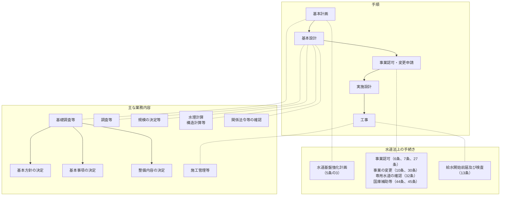

# 水道施設整備・設計指針 1.1 総説

> 出典・参照：水道施設設計指針 第1章 総説（p.2〜3）  
> 主な内容：水道施設整備の基本計画、強靭な施設構築、経費最適化（ライフサイクルコスト・脱炭素）、維持管理の充実（法定点検・施設台帳）、需要者への説明・意向反映、水道施設整備手順フロー

---

## 1.1 総説（前ページからの続き）

……など、合理的な事業運営が可能となるよう、検討を進めることが重要である。また、今後は、事業規模の水道システムに限らず、関係自治体等とも連携し、より広範なシステムとして、広域連携により対応していく視点も重要である。

したがって、水道事業者等には、「技術的基準を定める省令」に定める必要最低限の機能を満足するとともに、より高水準で合理的な施設整備を目指すことが望まれる。また、脱炭素に配慮した水道システムの構築や新たな技術等の導入など、事業や取組が多様化、複雑化していることから、目標設定にあたっては、説明責任を果たすとともに、社会情勢や水道利用者のニーズ等に配慮し、水道利用者の理解を得た上で施設整備を行うことが求められている。しかし、求められる水準の具体的な目標やそれを達成する過程は、個々の水道事業者が置かれている自然的・社会条件等によって大きく異なってくる。このため、各事業者には、地域特性や事業規模などを踏まえた独自の施設整備目標を設定することが求められる。また、目標達成には時間を要することから、長期的な展望に基づいた総合的な基本計画を策定することが必要になる。

施設整備や事業の実施にあたっては、次の点に留意する。

---

## 施設整備・事業実施における留意点

### 1. 基本計画の策定と見直し
水道施設整備の基本計画（この章においては、以下「基本計画」という。）の策定にあたっては、国や自治体が策定する長期的な地域・社会整備の方針・計画を踏まえるとともに、都道府県水道ビジョンや水道広域化推進プラン、水道基盤強化計画等の上位計画との整合やアセットマネジメントによる更新需要・財政収支を見据えていくことが必要である。具体的には、上位計画に配慮した人口予測や都市計画等を反映させた水需要を的確かつ長期的に予測・見直すことに加え、広域連携や今後の更新計画に合わせて、需要の動向や必要な予備能力を考慮した最適な施設規模への見直しや将来の事業運営体制等を検討するなど、適正な将来計画を策定する必要がある。

また、施設整備の途上で基本計画と社会のニーズとの不整合や、人口の変動、都市構造や社会経済情勢の変化などにより、水需要予測と実績との乖離が生じる可能性がある。このため、適宜、現状を把握・点検し、計画を検証・評価することが可能な事業運営体制を整備し、必要に応じて基本計画を見直すことが望ましい。

さらに、市街地から離れた小規模な集落等への送水方法の一形態である「運搬送水」については、「運搬送水に係る留意事項」について（厚生労働省通知、令和5年薬生水発0331第1号）が発出されており、今後は、「運搬送水」などの選択肢も含め、長期的な視点から、まちづくりや行政計画上の位置づけと整合させる必要がある。

なお、水道施設の設計においては、関連する法令や基準に準拠することはもとより、水道施設が土木・建築・機械・電気等の各分野にわたる設備で構成された総合システムであることを理解し、全体として調和のとれた施設とすることが望ましい。基本計画から設計、工事に至る全体の手順を図-1.1.1に示す。

---

### 図-1.1.1 水道施設の整備手順

#### 【図-1.1.1 整理表】

| 段階（手順） | 主な業務内容 | 水道法上の手続き・関連条文 |
| :--- | :--- | :--- |
| **基本計画** | **基礎調査等** ・基本方針の決定 ・基本事項の決定 ・整備内容の決定 | ・**水道基盤強化計画**（第5条の3） |
| **基本設計** | ・調査等 ・規模の決定等 ・水理計算、構造計算等 ・関係法令等の確認 | （基本計画〜基本設計に関連） |
| **事業認可・変更申請** | （認可申請・協議手続） | ・**事業認可**（第6条、第7条、第27条） ・**事業の変更**（第10条、第30条） ・**専用水道の確認**（第32条） ・**国庫補助等**（第44条、第45条） |
| **実施設計** | 詳細設計、積算、図面・仕様書作成等 | ― |
| **工事** | ・**施工管理等** | ・**給水開始前届 及び検査**（第13条） |

---

### 2. 強靭な水道施設の構築
水道は、平常時の給水はもとより、更新時や地震、風水害等の災害時および事故時等の非常時においても、可能な限り、給水を確保することが求められている。それに応えるためには、近年、激甚化・頻発化する災害や事故等を踏まえ、地震対策のみならず、風水害やテロ、停電、水質汚染、火山噴火、渇水、寒波等といった様々な事象への備えに万全を期していく必要がある。

このため、施設整備にあたっては、国や自治体で策定する被害想定やハザードマップ、過去の発災履歴等を参考とするとともに、施設における個々の要求性能を満たすだけでなく、安全性が損なわれた場合にも、危機的状況を避けるための危機耐性を有することも重要である。また、水道施設全体としてバランスのとれた安全性および冗長性を確保し、システムとしての対応力を向上させる必要がある。

具体的には、浄水場の予備能力確保や、送配水管ネットワークの強化、基幹管路の二重化、設備機器の防災性能の向上などである。さらに、事業体間の相互融通等の整備など、広域的な取組なども重要な視点である。

これら施設整備の計画にあたっては、災害等リスクの発生頻度や確率とともに、その被害の影響度、対策に要する費用等を考慮したリスクマネジメントの考え方に基づき、優先度を評価・選別していくことが重要である。

また、平成23年（2011年）東日本大震災では広域的な地震被害、大津波による施設の損傷、放射性物質の拡散、電力不足などの事態が生じた。このようなリスクへの備えも必要である（参考-1.1参照）。

---

### 3. 経費等の最適化
安全性・安定性のより高い施設の構築に加えて、水道事業の経営効率を高めるため、イニシャルコストとランニングコストとを総合的に捉えた水道施設全体のライフサイクルコストについての検討が必要となる。

これに加えて、施設等の建設から運転、廃棄に至るまでの全過程を通して脱炭素化の配慮が必要である。

また、これら水源から蛇口に至るまでの各水道施設を一連のシステムとして捉え、個々の施設を有機的に連携させることで、水道施設が全体として安定的かつ効率的に機能し、最適な規模となるよう配慮する。

加えて、個々の施設については、最新技術の導入も視野に入れた幅広い検討を行い、安全性を確保し、効率性を向上させることが必要である。

さらに、各事業体の実情や地域特性に応じて、事業統合や経営の一体化のほか、スケールメリットが期待できる施設の共同化や管理の一体化なども含めた広域連携や、経営基盤強化の手段の一つであるウォーターPPPの活用等を選択肢として検討することも重要である。

---

### 4. 維持管理の充実
平成30年（2018年）の改正水道法では、水道事業者等に対し、点検を含む施設の維持・修繕を行うことが義務付けられた。また、更新需要の増大に対しては、計画的な更新とともに、施設の長寿命化を図るなど、更新時期の平準化や財政負担の軽減を図っていくことも求められる。このため、定期的な点検や修繕はもとより、将来の改良・更新が容易に行えるよう施設の配置や構造、材質等に対して配慮しておく必要がある。

また、水道事業者等は、水道法により水道施設台帳の作成および保管について義務付けられており、施設の状態を定期的に調査、把握するとともに、その履歴を電子化保存し、データベース化を図ることで、施設の劣化予測等へ反映し、更新時期の設定をはじめとする予防保全管理に繋げていくなど、施設の計画的な維持管理や更新等、適切な資産管理を行えるようにしなければならない。

具体的には、水道管路の管体調査やコンクリート構造物の定期点検等により得られたデータを活用し、劣化を予測することで、適切な更新時期を設定し、実態を反映した更新需要を見通すことができる。

さらに、施設整備等が多様化する中で、より維持管理しやすい水道システムの構築が求められる。特に、技術者の減少や外部委託化の進展を考慮し、デジタル技術を活用した維持管理手法の導入や、維持管理マニュアルの整備、システムの自動化・簡素化・ネットワーク化を進める必要がある。

---

### 5. 需要者への説明および意向反映
水道をはじめとするライフラインにおいては、近年、災害対策など事業に対する関心が高まっており、需要者の理解や意見反映等の必要性が高まっている。

このため、必要に応じて、「水道事業ガイドライン（JWWA Q 100）」の業務指標（PI）を活用して事業目標の明確化や事業評価の結果を公表するなど、事業の必要性やその効果をわかりやすく説明し、計画や事業に対する需要者の理解を得ることが重要である。

また、パブリックコメント等の機会を設定するな（※画像末尾にて後続ページへ続く）
