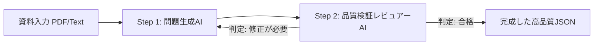

# 水道事業学習ドリル 問題作成設計ガイドライン
（PDF・資料からの問題生成マスター仕様書）

本書は、水道事業の計画書（水道ビジョン・経営戦略・財政計画など）や実務マニュアルなどの各種資料（PDF/Word/Excel/Markdown）から、**「水道事業ステップアップドリル」に最適なクイズ・学習問題を自動生成・作成するための設計思想および作成基準**を定めたものです。

LLM（Gemini, Claude, GPT等）に資料を読み込ませて問題を生成する際のシステムプロンプトやプロンプト指示書としてもそのまま活用できます。

---

## 目次
1. [基本理念と学習ゴール](#1-基本理念と学習ゴール)
2. [問題形式のバリエーションとUI仕様](#2-問題形式のバリエーションとui仕様)
3. [問題データのJSONスキーマ仕様](#3-問題データのjsonスキーマ仕様)
4. [出題タイプの黄金比（問題バランス）](#4-出題タイプの黄金比問題バランス)
5. [誤答（ディストラクター）の厳格な品質基準【最重要】](#5-誤答ディストラクターの厳格な品質基準最重要)
6. [問題文・数値設定・イラスト挿入ルール](#6-問題文数値設定イラスト挿入ルール)
7. [「日常のたとえ（analogy）」の作成極意](#7-日常のたとえanalogyの作成極意)
8. [解説（explanation）の構成テンプレート](#8-解説explanationの構成テンプレート)
9. [コース・ユニット・レッスンの構成ルール](#9-コースユニットレッスンの構成ルール)
10. [2段階検証システム（生成 ＋ レビュアー検証）](#10-2段階検証システム生成--レビュアー検証)
11. [LLM用プロンプトテンプレート（コピペ用）](#11-llm用プロンプトテンプレートコピペ用)

---

## 1. 基本理念と学習ゴール

### 🎯 ターゲット層（ペルソナ）
- **異動してきたばかりの職員・新入職員**（公営企業会計や水道工学の専門用語に不慣れ）
- **専門知識を体系的に復習・定着させたい実務担当者**

### 💡 4つの設計思想
1. **「暗記」ではなく「腹落ち（概念理解）」を目指す**
   - 単に法令条文や数値を丸暗記させるのではなく、「なぜそのルールがあるのか」「それが崩れるとどんなリスクがあるのか」を理解させる。
2. **「日常のたとえ」と「視覚的イラスト・図解」で専門用語の壁を壊す**
   - 難解な公営企業会計・減価償却・アセットマネジメント等を、家計・住宅・車・家電などの身近な生活例と分かりやすいイラストで直感的に定着させる。
3. **1レッスン10問のスナックラーニング & 反復定着**
   - 隙間時間（3〜5分）で1レッスンをテンポよく解ききれる長さに設計し、達成感を高める。
   - **重要項目・必須概念は切り口を変えて反復出題**し、確実な記憶の定着を促す。
4. **実務に直結する真面目で質の高い選択肢（ネタ・造語の完全排除）**
   - ネタ・ふざけた選択肢・幼稚な造語を徹底排除し、実務で実際に議論・混同される「実在の制度・手法」を誤答に採用する。

---

## 2. 問題形式のバリエーションとUI仕様

学習効率と操作性を最大化するため、設問内容に応じて以下の形式を最適に使い分けます。

| 形式種別 (`type`) | UI操作・特徴 | 出題シーン・活用例 |
| :--- | :--- | :--- |
| **① 標準4択問題**<br>(`choice`) | 4つの選択肢（A, B, C, D）から正解を1つタップ。 | 概念の定義、目的、法令根拠、重要数値を問う基本形。 |
| **② 一問一答 ⚪︎×問題**<br>(`true_false`) | **横並びの2分割大型タイル（左: ⚪︎ 正しい / 右: × 間違い）** から直感的にワンタップで選ぶ。<br>上部に大きな丸・バツのアイコンサークル、下部に「正しい」「間違い」の明快なテキストを配置したスマホ最適化UI。 | 単一の重要ファクトの正誤判定、よくある勘違いや引っかけ知識のチェック。 |
| **③ 線結び 組合せ問題**<br>(`matching`) | **左列の項目と右列の項目をタップして線で繋ぐ**インタラクティブ形式。 | 「用語と意味」「3条/4条と該当項目」「受水点と水源系統」の1対1対応。 |
| **④ 並び替え・手順問題**<br>(`ordering`) | カードをドラッグまたはタップして正しい順序に並べる。 | 災害発生時の緊急遮断弁作動〜応急給水のフロー、歴史的経緯の時系列。 |

---

## 3. 問題データのJSONスキーマ仕様

```json
{
  "id": "一意のID（例: hv_1_1_01, wf_2_3_05）",
  "type": "choice | true_false | matching | ordering",
  "question": "明確で簡潔な問題文（1問1意図）",
  "table": {
    "title": "📋 施設スペック表（半田配水場）",
    "headers": ["項目", "仕様・数値"],
    "rows": [
      ["施設名称", "半田配水場（主配水池）"],
      ["施設能力", "25,000 m³/日"],
      ["受水系統", "愛知中部水道企業団 1系統・2系統"],
      ["緊急遮断弁", "自動作動装置（震度5強で作動）"]
    ]
  },
  "options": [
    "選択肢1（※true_false の場合は [\"正しい\", \"間違い\"] または [\"⚪︎ 正しい\", \"× 間違い\"]）",
    "選択肢2",
    "選択肢3",
    "選択肢4"
  ],
  "answerIndex": 0,
  "matchingPairs": [
    { "left": "3条（収益的収支）", "right": "日々の給水運営に伴う損益" },
    { "left": "4条（資本的収支）", "right": "管路更新・施設建設等の投資と借入返済" }
  ],
  "explanation": "正解の根拠、正確な数値・法令条文、実務背景を論理的に解説",
  "explanationTable": {
    "title": "📊 3条収支と4条収支の比較表",
    "headers": ["区分", "根拠条項", "主な収入", "主な支出"],
    "rows": [
      ["収益的収支", "地方公営企業法第3条", "給水収益（水道料金）", "維持管理費、減価償却費"],
      ["資本的収支", "地方公営企業法第4条", "企業債、国庫補助金", "施設・管路建設改良費、企業債償還金"]
    ]
  },
  "analogy": "【日常のたとえ】身近な例（家計、車検、修繕積立金など）に置き換えた直感解説（※概念問題は必須）",
  "illustration": {
    "type": "concept_diagram | flow_chart | character_tip",
    "description": "イラストの内容説明（例: 家計簿と住宅ローンを比較するイラスト図解）"
  },
  "referenceSection": "原典資料の章・節・ページ番号（例: 第2章 2-1 水道事業の沿革 P.15）"
}
```

### 💡 ⚪︎×問題（`true_false`）のUI設計基準
- **レイアウト**: 画面下部に左右均等の**2分割大型角丸カード（2カラムグリッド）**として配置。
- **左カード（インデックス0）**:
  - 中央上部に大きなアクアブルーサークル ＋ 白抜きの太い「⚪︎（丸）」アイコン
  - 下部に大きな太字テキスト「正しい」
- **右カード（インデックス1）**:
  - 中央上部に大きなアクアブルーサークル ＋ 白抜きの太い「×（バツ）」アイコン
  - 下部に大きな太字テキスト「間違い」
- **直感操作**: スマホの片手操作・親指タップに最適化し、迷わず素早く解答できるテンポの良さを実現。

### 💡 データ表（`table` / `explanationTable`）のUI設計基準
- **問題文用テーブル (`table`)**:
  - 問題文の直下、選択肢や線結びペアの上に**すっきりとしたカード型テーブル**として挿入。
  - ヘッダーバーに「📋 表タイトル」を表示し、前提データ（施設スペック、財務データ、指標一覧など）を一目で把握可能にする。
- **解説用テーブル (`explanationTable`)**:
  - 正解判定後の解説欄内に**対比・整理用の比較表カード**（例: 「📊 3条 vs 4条 比較表」）として挿入。
- **視認性とレスポンシブ性**:
  - スマホの画面幅でも横スクロールせず収まるよう、**列数は2〜3列、行数は3〜6行程度**に厳選。
  - 枠線・交互背景・中央/左揃えを整え、清潔感のある洗練されたデザインを採用。

---

## 4. 出題タイプの黄金比（問題バランス）

1レッスン（10問）を構成する際、以下の比率で問題タイプを配分します。

| 割合 | 出題タイプ | 目的 | 推奨形式 |
| :--- | :--- | :--- | :--- |
| **40% (4問)** | **概念・仕組み理解** | 事業の大原則・法律・財務構造の本質を問う | `choice`（4択）、`matching`（線結び） |
| **30% (3問)** | **重要指標・計画数値** | 自治体・事業体の重要データや基準を覚える | `choice`（4択）、`true_false`（⚪︎×） |
| **30% (3問)** | **実務・リスク判断** | 現場で直面する判断や、異常時の影響を問う | `choice`（4択）、`ordering`（手順） |

---

## 5. 誤答（ディストラクター）の厳格な品質基準【最重要】

AIが問題を生成する際、**「正解だけを原典資料から丁寧にコピペして長文にし、誤答を適当な思いつきやネタで埋めてしまう」という悪癖**が最も発生しやすい問題です。以下の4原則を厳格に順守してください。

### ❌ 絶対にやってはいけないNGパターン

| NGの類型 | 実際の悪例（すべて禁止） | なぜNGか |
| :--- | :--- | :--- |
| **① ネタ・ふざけた選択肢** | 「施設が壊れるまで点検しない」「現金を山分けする」「水道管を爆破する」 | 読むだけで不正解と分かり、思考力・学習効果がゼロになる。 |
| **② 幼稚な造語・言葉の誤り** | 「ボランティア頼み制度」「自主自足制」「お任せ運営方式」 | 実務用語として存在しないため、実務試験としての品位とリアリティを損なう。 |
| **③ 文字量・熱量のアンバランス** | **正解:** 「保有する管路・施設の状態やリスクを中長期的に把握し…（70文字）」<br>**誤答:** 「完全国営化（5文字）」 | 文字数の長さだけで正解が見破られてしまう（正解バレ）。 |
| **④ 専門性の落差** | 正解のみ専門用語が多用され、誤答3つが中学生レベルの日常語 | 専門用語が使われている選択肢を選ぶだけの作業になってしまう。 |

---

### ⭕ 質の高い誤答を作る「4つの作問テクニック」

すべての誤答選択肢は、**「実務に実在する別の制度・類似手法・よくある実務上の誤解」**から構成します。

#### パターンA: 【概念・定義問題】実在する対立概念・別手法を採用する
> **設問例: 水道事業における「アセットマネジメント」の基本的な考え方はどれか？**
- ⭕ **正解**: 保有する資産の状態とリスクを中長期推計し、投資額を平準化しながら最小限のライフサイクルコストで計画更新する手法
- ⭕ **誤答1**: 法定耐用年数（40年）の到来のみを一律基準とし、健全度に関わらず全管路を順次更新する手法
- ⭕ **誤答2**: 過去の修繕履歴に基づき、漏水や突発事故が発生した箇所に限定して随時修繕を行う事後保全的手法
- ⭕ **誤答3**: 毎年度の一般会計繰入金の余剰枠に応じて、単年度ごとに更新対象箇所の優先順位をその都度決定する手法

#### パターンB: 【制度・用語問題】実在する類似の行政制度・管理手法を採用する
> **設問例: 民間事業者の資金・ノウハウを活用して公共サービスの質を高める手法の総称はどれか？**
- ⭕ **正解**: 官民連携（PPP / PFI、業務委託・包括的民間委託等）
- ⭕ **誤答1**: 直営管理方式（すべての業務を自治体職員が自前で執行する方式）
- ⭕ **誤答2**: 一部事務組合方式（複数自治体が共同で特別地方公共団体を設立する方式）
- ⭕ **誤答3**: 指定管理者制度（公の施設の管理権限を一括して代行させる制度）

#### パターンC: 【文字数・熱量の均一化ルール】
- 4つの選択肢の文字数は、**最長と最短の差が±20%以内**になるよう揃える。
- 文末表現（「〜する手法」「〜の原則」「〜を義務付ける規定」）を4択すべてで完全に統一する。

---

## 6. 問題文・数値設定・イラスト挿入ルール

### ① 問題文の作成ルール
1. **1問1意図（シングルフォーカス）**: 問われているポイントを明快にする。
2. **文字量**: スマホ画面で見やすいよう、問題文は2〜3行（60〜100文字程度）を目安とする。

### ② 数値を問う問題のルール（丸めと解説の補足）
- **選択肢の数字はある程度丸め、実務的に迷うスケール感にする**
  - ✖ 悪例: `7億2,500万円`, `1億1,111万円`, `99兆円`, `0円`
  - ⭕ 良例: `約3億円/年`, `約7億円/年`, `約15億円/年`, `約30億円/年`
- **解説（`explanation`）で正確な数字・内訳を補足する**
  - 例: 「計画上の過去10年間平均投資額は約7.25億円（幹線更新4.2億円、配水池更新3.05億円）です。」

### ③ イラスト・図解の挿入ルール
- 抽象的な概念（3条/4条のお金の流れ、減価償却の仕組み、受水ネットワークの多重化など）には、問題文や解説に理解を助ける簡単なイラスト説明（`illustration`）を付与する。

### ④ データ表（テーブル）の挿入ルール【重要】
複数の指標・施設スペック・制度を対比させる問題や、資料の抜粋データを読み取らせる問題では、問題文または解説に**表（テーブル）**を積極的に挿入します。

- **問題文に表（`table`）を挿入すべきシーン**:
  - **施設・管路スペック表**: 配水池容量、有効水深、管種（DIP/CIP/HP）、口径、受水系統一覧など。
  - **財務諸表・指標一覧**: 有収率、給水原価、料金回収率、繰入金割合、企業債残高などの実数・比較データ。
  - **線結び（`matching`）問題の前提表**: 「左列の項目（スペック）」と「右列の役割・たとえ」を線結びさせる前提となるスペック一覧表。
- **解説に表（`explanationTable`）を挿入すべきシーン**:
  - **制度・手法の対比表**: 「3条（収益的収支）vs 4条（資本的収支）」「直営方式 vs 包括的民間委託」「法定耐用年数一律更新 vs アセットマネジメント」など。
- **表作成の品質ルール**:
  - タイトルバーに `📋` や `📊` などのアイコンと明快なタイトルを記載する。
  - スマホの画面幅でも崩れずに読めるよう、**列数は2〜3列、行数は3〜6行程度**に要約・厳選する。

---

## 7. 「日常のたとえ（analogy）」の作成極意

概念理解問題には、必ず `【日常のたとえ】` を付与します。

| 水道事業・財政の概念 | 日常のたとえ |
| :--- | :--- |
| **3条（収益的収支）** | **毎月の家計簿（給与収入と食費・光熱費・家賃などの生活費）** |
| **4条（資本的収支）** | **マイホームの購入・リフォームローンや自動車の買い替え（大型投資と借入・返済）** |
| **内部留保資金（減価償却累計等）** | **将来の家電買い替えやリフォームのために貯めてある「修繕積立金・へそくり」** |
| **減価償却費** | **100万円の車を買い、10年かけて毎年10万円ずつ「価値の目減り分」として費用計上する仕組み（実際にお金が毎年財布から出ていくわけではない）** |
| **料金回収率（100%未満）** | **毎月の給与より生活費のほうが多く、毎月貯金を切り崩して生活している赤字状態** |
| **企業債（借入金）** | **住宅ローン（長期で借りて、将来世代と負担を分かち合いながら返済する）** |
| **アセットマネジメント（予防保全）** | **車の車検や定期オイル交換（壊れて動かなくなる前に点検・部品交換して長持ちさせる）** |
| **受水系統の多重化** | **スマホのデュアルSIMや、停電対策のポータブル予備バッテリー（1系統が切れても通信/給水を維持する）** |
| **スマートメーター（DX）** | **スマホのリアルタイム通信機能付き体重計・健康管理アプリ（自動で異常や漏水を検知する）** |

---

## 8. 解説（explanation）の構成テンプレート

解説は以下の3要素を標準構造として記述します。

```text
【解説の基本構成】
1. 結論（正解の理由）：「〇〇は地方公営企業法第〇条により、〜〜と定められています。」
2. 背景・実務知識・正確な数値：「水道事業では△△のため、××することが重要視されます。（計画数値：〇〇年平均〇〇億円）」
3. （必要に応じて誤答への言及）：「なお、選択肢Bの〜〜は△△に該当します。」
```

---

## 9. コース・ユニット・レッスンの構成ルール

1つの資料（PDF等）からコースを構築する場合、**3ユニット・計15レッスン（150問）** の構成を推奨します。

```text
【標準的な3ユニット構成】
├─ Unit 1: 基礎・全体像・沿革（制度の枠組み、基本理念、歴史、主要施設）
├─ Unit 2: 実務・主要施策（安全・強靭施策、水質管理、耐震化、老朽管更新）
└─ Unit 3: 経営戦略・DX・広域連携（アセットマネジメント、投資財政計画、官民連携、総合ケーススタディ）
```

---

## 10. 2段階検証システム（生成 ＋ レビュアー検証）

問題を生成する際は、**「① 問題生成エージェント」** と **「② 品質検証レビュアー（サブエージェント）」** の2段階パイプラインを実行して品質を担保します。



### 🧐 レビュアー検証チェックリスト（6大監査項目）
1. **[ネタ排除]** 「現金を山分け」「壊れるまで放置」「ボランティア頼み」などのネタ・ふざけた選択肢・幼稚な造語が1つも存在しないか？
2. **[文字量均等]** 正解と誤答の間で文字数に極端な差がないか？（最長と最短の差が±20%以内か）
3. **[熱量均等]** 正解だけが専門用語で詳しく書かれ、誤答が雑・抽象的になっていないか？
4. **[実在誤答]** 誤答3つすべてが「実在する別の行政手法・類似制度・よくある実務上の誤解」になっているか？
5. **[たとえ付与]** 概念理解問題に適切な `analogy`（日常のたとえ）が記載されているか？
6. **[事実正確性]** 法令条文・計画数値・出典（`referenceSection`）に誤りがないか？

---

## 11. LLM用プロンプトテンプレート（コピペ用）

PDFやテキスト資料から問題を生成する際は、以下のプロンプトを使用してください。

````markdown
# 命令書: 水道事業学習ドリル問題の作成＆厳格品質レビュー

添付の資料（PDF/テキスト）の内容を読み込み、「問題作成設計ガイドライン」に厳格に従って、水道事業職員向けの学習クイズ問題（1レッスン10問）を生成し、自己レビューを経てJSON形式で出力してください。

---

## 【重要】第1段階: 作問ルール
1. **対象読者**: 異動したての水道事業職員・新入職員
2. **問題数**: 10問（1レッスン分）
3. **問題形式**:
   - 4択問題 (`choice`) を基本とし、設問に応じて一問一答 ⚪︎× (`true_false`) や左右線結び (`matching`) を適宜配分。
4. **データ表（`table` / `explanationTable`）の積極活用**:
   - 施設スペック、財務諸表、経営指標の抜粋データを問う場合や、線結び問題の前提データとして問題文に表（`table`）を挿入する。
   - 正解・制度の対比整理（3条 vs 4条、直営 vs 委託等）には解説表（`explanationTable`）を挿入する。
5. **誤答（ディストラクター）の厳格作成原則【最重要】**:
   - **ネタ・ふざけた選択肢・幼稚な造語の完全禁止**（「山分け」「ボランティア頼み」「自主自足制」等は厳禁）。
   - **誤答はすべて実在する類似制度・対立概念・よくある実務上の誤解から作成すること**。
   - **4つの選択肢の文字数（±20%以内）と文体・専門用語の熱量を完全に揃えること**（正解だけ長文・専門的になる現象を厳禁とする）。
6. **日常のたとえ (`analogy`)**: 概念理解問題には、家計・住宅・車・家電などに例えた直感的な解説を必ず付与すること。
7. **参照元 (`referenceSection`)**: 資料の該当する章・節・ページ番号を明記すること。

---

## 【重要】第2段階: 品質検証サブエージェントによる自己監査
出力前に、以下のチェックリストで10問すべてを監査してください。
- [ ] ネタ選択肢・幼稚な造語が1つも含まれていないか？
- [ ] 正解と誤答の文字数差が±20%以内に収まっているか？
- [ ] 正解だけが専門的で、誤答が雑になっていないか？
- [ ] 誤答3つすべてが「実在する別の行政手法・制度・実務上の誤解」になっているか？
- [ ] 必要に応じて適切なデータ表（`table` / `explanationTable`）が挿入されているか？
- [ ] 法令・数値・出典に誤りがないか？

---

## 出力フォーマット（JSON配列のみを出力）
```json
[
  {
    "id": "lesson_3_01",
    "type": "choice",
    "question": "水道事業における「アセットマネジメント」の基本的な考え方として、最も適切なものはどれですか？",
    "options": [
      "保有する資産の状態とリスクを中長期推計し、投資額を平準化しながら最小限のライフサイクルコストで計画更新する手法",
      "法定耐用年数（40年）の到来のみを一律基準とし、資産の健全度に関わらず全管路を機械的に順次更新する手法",
      "過去の修繕履歴に基づき、漏水や突発事故が発生した箇所に限定してその都度対応を行う対症療法的手法",
      "毎年度の一般会計繰入金の余剰枠に応じて、単年度ごとに更新対象箇所の優先順位を決定する手法"
    ],
    "answerIndex": 0,
    "explanation": "アセットマネジメントとは、中長期的な更新需要を推計し、投資ピークを平準化しながら資産全体を最適管理する手法です。画一的一斉更新や突発修繕のみの手法とは明確に区別されます。",
    "analogy": "【日常のたとえ】自宅の外壁や屋根、給湯器などを「10年後・20年後にいくらかかるか」見通しを立て、修繕積立金を計画的に積み立てて直していく計画修繕と同じです。",
    "referenceSection": "第5章 5-3 持続可能な水道事業の実現 P.42"
  },
  {
    "id": "lesson_3_02",
    "type": "matching",
    "question": "以下のスペック表の項目（左列）と、それぞれの役割・日常のたとえ（右列）を正しく結びつけてください。",
    "table": {
      "title": "📋 半田配水場 主要設備スペック表",
      "headers": ["項目", "仕様・数値"],
      "rows": [
        ["配水池容量", "25,000 m³（市内1日最大給水量相当）"],
        ["緊急遮断弁", "震度5強以上で自動閉塞し飲料水を確保"],
        ["非常用発電機", "停電時48時間連続運転可能"]
      ]
    },
    "matchingPairs": [
      { "left": "配水池容量（25,000m³）", "right": "巨大な水筒（非常時も1日分の水を確保）" },
      { "left": "緊急遮断弁", "right": "水筒の自動ストッパー（地震時に流出を防ぐ）" },
      { "left": "非常用発電機", "right": "予備バッテリー（停電でもポンプを動かし続ける）" }
    ],
    "options": [],
    "answerIndex": 0,
    "explanation": "半田配水場は市内の基幹施設であり、25,000m³の容量と地震時の緊急遮断弁、停電対策の自家発電設備を備えて強靭化を図っています。",
    "analogy": "【日常のたとえ】キャンプで例えると「大容量タンク」「漏れ防止弁」「ポータブル電源」をセットで備えている状態です。",
    "referenceSection": "第3章 3-1 基幹施設の耐震化 P.24"
  },
  {
    "id": "lesson_3_03",
    "type": "true_false",
    "question": "地方公営企業法第17条の2に基づき、水道事業の運営に必要な経費は、原則として税金（一般会計）ではなく、水道料金収入で賄う独立採算制が定められている。",
    "options": [
      "正しい",
      "間違い"
    ],
    "answerIndex": 0,
    "explanation": "地方公営企業法第17条の2により「独立採算制の原則」が定められており、給水サービスに必要な経費は原則として利用者からの水道料金収入によって賄われます。",
    "explanationTable": {
      "title": "📊 独立採算制と一般会計負担の原則区分",
      "headers": ["区分", "負担すべき経費", "財源"],
      "rows": [
        ["利用者負担（料金）", "日々の維持管理費、減価償却費、管路更新費", "水道料金収入"],
        ["公費負担（税金・繰入金）", "消火栓維持管理等の消防用経費、高料金対策", "一般会計繰入金"]
      ]
    },
    "analogy": "【日常のたとえ】カフェやスーパーが売上金で仕入れ代や光熱費・家賃を支払って自立経営するのと同じで、税金に頼らず自分たちの料金で事業を成り立たせる大原則です。",
    "referenceSection": "第1章 1-2 水道事業の経営基本原則 P.10"
  }
]
```
````
