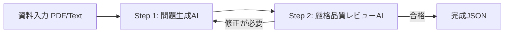

# 水道事業学習ドリル 問題作成設計ガイドライン
（PDF・資料からの問題生成マスター仕様書 & LLMプロンプト設計書）

本書は、水道事業の計画書（水道ビジョン・経営戦略・財政計画など）や実務マニュアルなどの各種資料（PDF/Word/Excel/Markdown）から、**「水道事業ステップアップドリル」に最適なクイズ・学習問題をAIで自動生成・作成するための設計仕様書**です。

---

## 📑 全体構成
- [第1部：問題作成コア設計＆厳格品質基準](#第1部問題作成コア設計厳格品質基準)
  - 1. [基本理念と学習ゴール](#1-基本理念と学習ゴール)
  - 2. [問題形式のバリエーションと形式別JSONスキーマ](#2-問題形式のバリエーションと形式別jsonスキーマ)
  - 3. [コース・ユニット・レッスンの構成ルール](#3-コースユニットレッスンの構成ルール)
  - 4. [出題タイプの黄金比（問題バランス）](#4-出題タイプの黄金比問題バランス)
  - 5. [問題文・選択肢の厳格作成基準【最重要】](#5-問題文選択肢の厳格作成基準最重要)
  - 6. [図・表・グラフの厳格抑制ルール【ノイズ完全排除】](#6-図表グラフの厳格抑制ルールノイズ完全排除)
  - 7. [「日常のたとえ（analogy）」の作成極意](#7-日常のたとえanalogyの作成極意)
  - 8. [解説（explanation）の標準構成](#8-解説explanationの標準構成)
- [第2部：LLM用 プロンプトテンプレート（コピペ用）](#第2部llm用-プロンプトテンプレートコピペ用)
  - 9. [2段階検証生成システム](#9-2段階検証生成システム)
  - 10. [実行プロンプト（資料＋コピペ用完全版）](#10-実行プロンプト資料コピペ用完全版)
- [付録：アプリUI・デザインシステム仕様（開発者向け）](#付録アプリuiデザインシステム仕様開発者向け)

---

# 第1部：問題作成コア設計＆厳格品質基準

## 1. 基本理念と学習ゴール

### 🎯 ターゲット層（ペルソナ）
- **異動してきたばかりの職員・新入職員**（公営企業会計や水道工学の専門用語に不慣れ）
- **専門知識を体系的に復習・定着させたい実務担当者**

### 💡 5つの設計思想
1. **「資料原本直結」の出題（一般論・他自治体テンプレの完全排除）【最重要】**
   - 必ず提示資料の該当ページ（P.○）に**実際に記載されている施策・数値・課題**を起点に出題する。全国の水道一般論（鉛管対策など）を勝手に持ち込まず、資料に書いてある内容のみを出題根拠とする。
2. **「暗記」ではなく「腹落ち（概念理解）」を目指す**
   - 単なる条文や数値の丸暗記ではなく、「なぜそのルールがあるのか」「それが崩れるとどんなリスクがあるのか」を理解させる。
3. **「日常のたとえ」による直感理解**
   - 難解な公営企業会計や工学用語を、冷蔵庫・備蓄庫・車検・通信回線などの身近な生活例で定着させる。
4. **1レッスン8〜12問のスナックラーニング & 反復定着**
   - 一律10問に固定せず、重要概念を深く理解するために最適な問題数（8〜12問）を設計。隙間時間（3〜5分）で解ききれるテンポ感を保つ。
5. **実務に直結する真面目で質の高い選択肢（ネタ・造語の完全排除）**
   - ネタや幼稚な造語を徹底排除し、実務で実際に議論・混同される「実在の制度・手法」を誤答に採用する。

---

## 2. 問題形式のバリエーションと形式別JSONスキーマ

設問の意図に応じて、以下の5つの形式を使い分けます。**形式（`type`）ごとに必要なプロパティのみを出力**します。

### ① 標準4択問題 (`type: "choice"`)
- **用途**: 概念の定義、目的、法令根拠、重要数値を問う基本形。
- **問題文の強調（太字）ルール【厳格判定】**:
  - 【肯定形】（「最も適切なもの」「正しいもの」を問う場合） ➔ **太字にしない**（通常テキスト）。
  - 【否定形】（「**適切でないもの**」「**誤っているもの**」「**含まれないもの**」を問う場合） ➔ 必ず **太字** にして注意喚起する。
```json
{
  "id": "hv_1_1_01",
  "type": "choice",
  "question": "水道事業における「独立採算制の原則（地方公営企業法第17条の2）」の基本的な考え方として最も適切なものはどれですか？",
  "options": [
    "事業運営に必要な経費は原則として税金ではなく利用者の水道料金収入によって賄う原則",
    "施設の建設改良費を含むすべての支出を毎年度の一般会計からの繰入金のみで賄う原則",
    "各自治体が独自に法令を制定し国や県の指導を受けずに自由に料金設定を行える原則",
    "将来の人口減少に関わらず過去の最大給水量を維持する規模で施設更新を継続する原則"
  ],
  "answerIndex": 0,
  "explanation": "地方公営企業法第17条の2に基づき、公営企業は経費を利用者からの料金収入で賄う「独立採算制」が基本原則となっています。これにより、税金に過度に依存せず、サービスの受益者が費用を公平に負担する健全な経営が求められます。\n\n※一般会計からの繰入金に全額依存する運営や、国の基準を無視した独自設定は認められていません。",
  "analogy": "家計や民間企業と同じで、日々の生活費や仕入れ代を他人の援助（税金）に頼らず、自分自身の稼ぎ（水道料金）で賄って自立運営する大原則です。",
  "referenceSection": "第1章 1-1 水道事業の経営基本原則 P.5"
}
```

### ② 一問一答 ⚪︎×問題 (`type: "true_false"`)
- **用途**: 単一の重要ファクト、正誤判定、よくある勘違いのチェック。
- **仕様**: `options` は常に `["正しい", "間違い"]`、正解が「正しい」なら `answerIndex: 0`、「間違い」なら `answerIndex: 1`。
```json
{
  "id": "hv_1_1_02",
  "type": "true_false",
  "question": "水道事業の会計において、日々の給水活動に伴う日常的な損益（収益的収支）を管理するのは「地方公営企業法第4条」である。",
  "options": ["正しい", "間違い"],
  "answerIndex": 1,
  "explanation": "日々の給水活動に伴う日常的な損益（収益的収支）は「第3条」で管理します。「第4条」は施設整備や借入金返済などの長期投資（資本的収支）を扱います。",
  "analogy": "毎月の生活費家計簿が第3条、マイホームのローンやリフォーム口座が第4条です。",
  "referenceSection": "第2章 2-1 3条と4条の区分 P.12"
}
```

### ③ 語句の穴埋め問題 (`type: "fill_in_the_blank"`)
- **用途**: 条文・重要キーワードの定着、対比概念の理解確認。
- **仕様**: `blankText` に `【空欄1】`, `【空欄2】` を含め、`blanks` 配列に正解を定義。`options` にダミー含む選択肢を列挙。
```json
{
  "id": "hv_1_1_03",
  "type": "fill_in_the_blank",
  "question": "公営企業会計の基本構造について、以下の空欄に適する語句を選択肢から選んでください。",
  "blankText": "日々の給水サービスに伴う損益を管理するのが【空欄1】であり、将来の施設整備や企業債償還などの長期投資を管理するのが【空欄2】である。",
  "blanks": [
    { "id": 1, "answer": "収益的収支（第3条）" },
    { "id": 2, "answer": "資本的収支（第4条）" }
  ],
  "options": [
    "収益的収支（第3条）",
    "資本的収支（第4条）",
    "一般会計繰入金",
    "企業債残高"
  ],
  "answerIndex": 0,
  "explanation": "地方公営企業法において、経常的な損益は第3条、資本的投資は第4条として明確に区分経理されます。",
  "analogy": "毎月の食費・光熱費の「生活費家計簿」が第3条、住宅ローン返済などの「大型投資口座」が第4条です。",
  "referenceSection": "第2章 2-1 公営企業会計の仕組み P.15"
}
```

### ④ 並び替え・手順問題 (`type: "ordering"`)
- **用途**: 浄水処理工程、漏水・災害初動フロー、予算調製プロセスの時系列。
- **仕様**: `orderItems` にステップ一覧、`correctOrder` に正しい `id` の配列順を記述。
```json
{
  "id": "hv_1_1_04",
  "type": "ordering",
  "question": "浄水場における一般的な浄水処理工程を、正しい順番に並べてください。",
  "orderItems": [
    { "id": "step_1", "text": "着水井で原水を受け入れ、砂や大きな浮遊物を沈殿除去する（沈砂）" },
    { "id": "step_2", "text": "凝集剤（PAC）を急速混和し、微細な濁質をフロックに成長させる" },
    { "id": "step_3", "text": "薬品沈殿池でフロックを沈め、砂ろ過池で細かい濁りを除去する" },
    { "id": "step_4", "text": "次亜塩素酸ナトリウム等で消毒を行い、安全な浄水として配水池へ送る" }
  ],
  "correctOrder": ["step_1", "step_2", "step_3", "step_4"],
  "explanation": "浄水処理は「沈砂・受入 → 薬品凝集 → 沈殿・ろ過 → 塩素消毒」の順序で濁質や細菌を除去し、安全な水道水を製造します。",
  "analogy": "料理の「①アク取り → ②調味料で灰汁を固める → ③ザルで漉す → ④加熱殺菌して盛り付ける」と同じステップです。",
  "referenceSection": "第3章 3-2 浄水処理工程 P.22"
}
```

### ⑤ 線結び 組合せ問題 (`type: "matching"`)
- **用途**: 「用語と意味」「条文と該当項目」「施設と役割」の1対1対応。
- **仕様**: `matchingPairs` に左右の正解ペアを2〜4組定義。
- **線結び（matching）の採用可否ルール【厳格判定】**:
  - ⭕ **採用してよい場合**: 「混同しやすい同位の3概念」（例: 毎日検査／水質基準検査／自動連続監視、耐震適合率／経年化率／管路更新率）のように、共通の基準や時間軸で相互に整理・比較させる場合。
  - ❌ **採用を禁止する場合**: 左の単語と右の説明文に同一の固有名詞（例: 「受水槽」➔「受水槽指導」）が含まれ、**単語の一致だけでペアが即座に限定されてしまう場合**。
  - ➔ **転換指示**: キーワード一致でペアが自明になる場合は、線結びを廃止し、**「正しい3つの取組 ＋ 誤っている取組1つ」を選ばせる4択問題（NOT問題）** に転換すること。
```json
{
  "id": "hv_1_1_05",
  "type": "matching",
  "question": "配水場の主要設備と、それぞれの役割・日常のたとえを正しく結びつけてください。",
  "matchingPairs": [
    { "left": "配水池容量（25,000m³）", "right": "巨大な水筒（災害時も市内1日分の飲料水を確保）" },
    { "left": "緊急遮断弁", "right": "水筒の自動ストッパー（震度5強以上で自動閉塞し水を残す）" },
    { "left": "非常用自家発電機", "right": "予備バッテリー（停電時も48時間連続運転可能）" }
  ],
  "explanation": "半田配水場は市内の基幹施設であり、大容量貯留・自動遮断弁・非常用電源を備えて災害時の給水継続性を高めています。",
  "referenceSection": "第3章 3-1 基幹配水施設のスペック P.24"
}
```

---

## 3. コース・ユニット・レッスンの構成ルール

コース全体の**ユニット数・レッスン数・問題数は固定値にせず**、資料のボリュームや職員が習得すべき体系性に応じて設計します。

1. **ユニット（テーマ分類）**:
   - 資料の論点（例: 基礎・理念 / 施策・水質・耐震 / 財務・会計・経営戦略）に応じて自然な学習順（基礎 ➔ 実務 ➔ 応用）で編成（通常2〜4ユニット）。
2. **レッスン（1トピック1レッスン）**:
   - 「何を学んだかが一言で言える粒度」で分割。
3. **問題数（1レッスンあたり【8〜12問】）**:
   - 一律10問に固定せず、トピックの重要概念・数値を網羅し、理解確認・反復定着に最適な問題数（8〜12問）を設定。

---

## 4. 出題タイプの黄金比（問題バランス）

1レッスン（8〜12問）内で、以下の比率を目安にバランスよく配分します。

| 割合 | 出題タイプ | 目的 | 推奨形式 |
| :--- | :--- | :--- | :--- |
| **40% (3〜5問)** | **概念・仕組み理解** | 事業の大原則・法律・財務構造の本質を問う | `choice`, `fill_in_the_blank`, `matching` |
| **30% (2〜4問)** | **重要指標・計画数値** | 自治体・事業体の重要データや基準を覚える | `choice`, `true_false`, `fill_in_the_blank` |
| **30% (2〜4問)** | **実務・リスク判断** | 現場で直面する判断や、異常時の影響を問う | `choice`, `ordering` |

---

## 5. 問題文・選択肢の厳格作成基準【最重要】

AIが問題を生成する際、**「報告書特有の冗長な前置きで問題文を長くする」「正解だけを資料からコピペして長文にし、誤答を適当な思いつきやネタで埋める」現象を完全に禁止し、軽快で本質的な学習体験を提供**します。

### 📝 問題文のスリム化・前置き完全排除ルール【厳格判定】
1. **報告書特有の形式ばった前置き・章番号の完全排除**:
   - ❌ NG: 「第3章の強靭化に関する進捗評価において、重要給水施設へ繋がる〜〜」
   - ❌ NG: 「職員ヒアリング等から抽出された持続可能な組織・業務体制の課題において、〜〜」
   - ⭕ OK: 「重要給水施設（避難所・病院等）へ繋がる基幹管路の耐震化について、〜〜」
   - ⭕ OK: 「水道事業の業務効率化と技術継承を推進するための取り組みとして、〜〜」
   - 出典・章節番号は `referenceSection` に記載するため、問題文内には一切入れない。
2. **本質的施策の優先出題（形式的マニュアル・内部手続きの回避）**:
   - 「〜マニュアルの作成」「〜の検討に着手」といった単なる事務手続き・形式的な取り組みを正解にする出題は避け、「直結給水方式の推進」「2系統化・ループ化」「アセットマネジメントによる平準化」「施設台帳の一元化」など、**水道事業の根幹や市民サービスに直結する具体的・本質的な施策**を出題テーマとして優先する。
3. **問題文の文字数目安**:
   - 冗長な背景説明は「解説（`explanation`）」に集約し、問題文自体は **40〜60文字程度** で論点をシャープに伝える。

### ❌ 7大禁止パターン
1. **ネタ・ふざけた選択肢・極端な荒唐無稽の禁止**
   - （例: 「水道管を爆破する」「水質検査を廃止する」「全額寄付金で運営する」など、誰が見ても明らかな嘘は作らない）
2. **幼稚な造語の禁止**
   - （例: 「ボランティア頼み制度」「自主自足制」「お任せ運営方式」）
3. **選択肢内の補足説明・カッコ書きの禁止【最重要】**
   - 選択肢は「問われている対象そのもの」をシンプルに記述し、`（最大の費用項目）` `（緩やかな減少傾向）` `（税金）` などの**補足解説・ヒント・カッコ書きを一切入れない**。
   - 理由や背景、補足情報はすべて「解説（`explanation`）」に集約させる。
4. **ヒントの抱き合わせ（ネタバレ併記）の禁止**
   - 選択肢の中に「年度」と「人口数値」を両方書くなど、複数の情報を併記して消去法で答えが推測できてしまうネタバレを禁止する。
5. **文字数・熱量の不均衡禁止（正解バレ防止）**
   - 正解だけ70文字で詳しく、誤答が10文字など ➔ **最長と最短の差は±20%以内**にする。
6. **専門性の落差禁止**
   - 正解だけ専門用語が多く、誤答が日常語になることを防ぐ。全選択肢で専門性のトーンを均一化する。
7. **問題文における不要な太字の禁止**
   - 通常の「最も適切なもの」「正しいもの」は**太字にしない**。イレギュラーな否定形（「**適切でないもの**」「**誤っているもの**」）のみ太字にする。

### ⭕ 質の高い選択肢・誤答を作るテクニック
- **問題文の太字判定ルール**:
  | 設問の意図 | 問題文の表記例 | 太字の要否 |
  | :--- | :--- | :--- |
  | **肯定形（標準）** | 「〜として、最も適切なものはどれですか？」 | **太字にしない**（通常文字） |
  | **否定形（イレギュラー）** | 「〜として、**適切でないもの**はどれですか？」 | **必ず太字**にする |
  | **否定形（イレギュラー）** | 「〜として、**誤っているもの**はどれですか？」 | **必ず太字**にする |

- **数値選択肢の丸め処理と有効数字の統一**:
  - 数値問題の選択肢は、端数の細かすぎる表記（例: 36,941m³）ではなく、実務・学習として記憶しやすい**「適切な有効数字（10の位や100の位での丸め処理：約36,940 m³/日）」**に揃える。
  - 誤答の選択肢も同一の桁数・丸め単位で揃え、不自然なバラつきをなくす。
- **実在する対立概念・別の行政手法を採用する**:
  - 例: 正解が「業務効率化・民間委託・広域化」なら、誤答は「自前大型浄水場の新設による全量自営化」「すべての民間委託を廃止して完全直営化」「施設更新投資の無期限凍結」など、実務で実際に議論・混同される選択肢にする。
- **選択肢の文字数制限（原則36文字以内・均一化）**:
  - 4択問題の選択肢は、軽快に問題を解く体験を重視し、**原則36文字以内**とする（好ましくは30〜35文字程度）。
  - 不要な助詞や冗長な修飾語を省き、4選択肢すべての文字数を美しく揃える。
  - 文末表現（名詞止め、動詞止めなど）を4択すべてで徹底的に統一する。
  - ただし、問題の構成上、それ以上の説明がないとベストな学習とならない場合は、必要最小限で超えることができる。
- **文末表現を統一する**: 「〜する手法」「〜の原則」「〜を義務付ける規定」など、語尾を4択すべてで揃える。

---

## 6. 図・表・グラフの厳格抑制ルール【ノイズ完全排除】

### 🚫 原則：図・表・グラフは「原則挿入しない」
テキストだけで伝わる内容に安易に図・表・グラフを付与してはなりません。不要なビジュアルはスマホ画面でのスクロール量を増やし、学習の集中を妨げる**認知ノイズ**になります。

### ⭕ 挿入を許可する唯一の条件（無いと説明が破綻する場合のみ）
- **帯グラフ（`breakdownGraph`）**: 収入内訳や耐震化率など、**「構成比率の読み取りそのものが設問の主旨である場合」**のみ。
- **概念図解（`diagram`）**: 複雑な配水系統やネットワーク接続など、**「図が無いと物理的位置関係が理解不可能な場合」**のみ。
- **問題用テーブル（`table`）**: **「表中のデータを読み取って計算・推論させる場合」**のみ（※答えが表にそのまま書いてあるネタバレ表は完全禁止）。
- **解説用比較表（`explanationTable`）**: 3条 vs 4条の複数軸対比など、**「文章で書くと構造が破綻する場合」**のみ。

### 💧 【コース3（給水装置設計・審査実務）における特例緩和ルール】
コース3『給水装置設計技術計算と審査実務』では、実際の給水装置工事図面の審査や水理計算書の検証実務を扱うため、**上記の厳格抑制ルールを緩和**します。
- **出題・解答・解説の質が向上する場合、図表・テーブル（`table`, `diagram`, `explanationTable`等）を積極的に用いて良い**こととします。
- **具体的に推奨される活用場面**:
  1. **配管系統・水頭概念図**: 水頭差（位置水頭・圧力水頭・設計水頭・有効水頭・余裕水頭）の視覚的把握
  2. **水理計算用テーブル**: 区間ごとの管径・管長・流量・動水勾配・損失水頭データの提示
  3. **換算表・データ表**: 継手類の直管換算長表、器具給水負荷単位表、管径均等表、定水位弁流量表の読み取り
  4. **解説用図解・フロー図**: 水理解析の検算ステップや審査フローの整理
※ただし、単なる装飾目的の無意味な図表や、答えがそのまま一目で分かってしまうネタバレ表の禁止は継続します。


---

## 7. 「日常のたとえ（analogy）」の作成極意

初学者がイメージしにくい専門用語・概念理解問題には、身近な生活例（家計・車・家電・住宅など）に置き換えた日常のたとえを付与します。（※UI側で自動表示されるため、本文先頭に `【日常のたとえ】` というラベルは不要です）

| 水道事業・工学の概念 | 日常のたとえの例 |
| :--- | :--- |
| **作り置きタンク・受水槽** | **家庭の冷蔵庫やパントリー（食物庫・備蓄庫）**（大元のスーパーから新鮮な品を仕入れ、手元で一時保管していつでも使えるようにする設備） |
| **3条（収益的収支）** | **毎月の家計簿（給料と食費・光熱費などの生活費）** |
| **4条（資本的収支）** | **マイホームの購入・リフォームローンや自動車の買い替え（大型投資と借入・返済）** |
| **アセットマネジメント（予防保全）** | **車の定期車検やオイル交換（壊れて動かなくなる前に点検・部品交換して長持ちさせる）** |
| **受水系統の多重化・連絡管** | **インターネットの光回線とモバイル予備回線の二重化（メイン回線が切れても通信を途切れさせない）** |
| **緊急遮断弁（耐震安全装置）** | **地震の大きな揺れでガスの元栓が自動でガチッと閉まるガスメーターの安全機能** |

---

## 8. 解説（explanation）と出典（referenceSection）の標準構成

### 📖 解説文の標準ルール【ピンポイントフォロー方式】
1. **正答の丁寧な解説（主解説）**:
   - 正解となった制度・施策の背景、法令根拠、正確な数値を分かりやすく丁寧に解説する。
2. **誤答の全網羅解説の禁止**:
   - 「・Aのひっかけ解説」「・Bのひっかけ解説」のように、すべての誤答選択肢に対して機械的に解説を羅列することを**禁止**する（長大化し学習効果が落ちるため）。
3. **ピンポイントフォロー（※注記）**:
   - 誤答の中で特に実務上勘違いしやすいポイントや、教育的価値の高い項目のみを**「※〜〜」として1〜2点ピンポイントで注記**する。

### 📌 出典（referenceSection）の完全一致ルール【ハルシネーション厳禁】
- AIが推測で図表番号やページ番号、未掲載の計算値を捏造することを厳禁とする。
- 必ず元資料の**目次・節見出し・図表番号・ページ番号と100%一致**させて記載する。
  - 例: `第5章 5-1 安全な水の供給（受水槽管理者への指導 P.35）`
- **問題文の中には冗長なページ番号や節タイトルを入れず**、設問自体は簡潔に記述する。

---

# 第2部：LLM用 プロンプトテンプレート（コピペ用）

## 9. 2段階検証生成システム

問題生成時は、**「Step 1: 問題生成」➔「Step 2: 品質監査（自己レビュー）」** の2段階を実行して出力します。



---

## 10. 実行プロンプト（資料＋コピペ用完全版）

以下のプロンプト枠をそのままLLM（Gemini, Claude, GPT等）にコピー＆ペーストし、対象資料を添付して実行してください。

````markdown
# 命令書: 水道事業学習ドリル問題の作成＆厳格品質レビュー

添付の資料（PDF/テキスト）の内容を読み込み、「水道事業ステップアップドリル」向けの高品質な学習クイズ問題（1レッスンあたり8〜12問）を生成し、自己レビューを経てJSON配列形式のみで出力してください。

---

## 【第1段階】作問ルール
1. **対象読者**: 異動したての水道事業職員・新入職員（初学者）
2. **出題根拠の徹底【最重要】**:
   - 必ず提示資料の該当ページ（P.○）に**実際に記載されている施策・数値・課題**を起点に出題すること。全国一般論や他自治体のテンプレを勝手に混入させないこと。
   - 最新の法令・国基準（例: 水道水質基準全52項目等）との整合性に配慮すること。
3. **構成設計**: 資料の体系性に応じてユニット・レッスンを編成し、1レッスンあたり【8〜12問】で構成すること。
4. **問題文のスリム化・前置き排除【厳格ルール】**:
   - 「第○章の〜〜において」「ヒアリング等から抽出された〜〜において」等の報告書形式の冗長な前置きや章番号は一切入れず、**40〜60文字程度で論点を端的に問うこと**。
   - 単なる「マニュアルの作成」「検討」などの内部事務手続きに終始せず、**事業根幹や市民給水に直結する具体的・本質的な取り組み（直結給水、2系統確保、投資平準化等）を優先して出題すること**。
5. **問題形式と問題文の太字ルール**:
   - 4択（`choice`）を基本とし、⚪︎×（`true_false`）、穴埋め（`fill_in_the_blank`）、並び替え（`ordering`）、線結び（`matching`）を適宜配分すること。
   - **【太字判定】肯定形（「最も適切なもの」「正しいもの」）は太字にしない**こと。
   - **【太字判定】否定形（「**適切でないもの**」「**誤っているもの**」等）のみ必ず太字で強調**すること。
6. **線結び（`matching`）の適用判定**:
   - 同位の3大概念の整理にのみ適用すること。左の語句と右の説明に同一単語（例: 「受水槽」➔「受水槽指導」）が含まれペアが自明になる場合は、線結びを禁止し、**「正しい3つの取組 ＋ 誤っている取組1つ」を選ばせる4択NOT問題**に転換すること。
7. **選択肢・誤答の厳格基準【正解バレ完全防止】**:
   - ネタ・ふざけた選択肢・極端な荒唐無稽（「検査廃止」「寄付金運営」等）は完全禁止。
   - 誤答はすべて「実在する類似制度・対立概念・実務上の誤解」から作成すること。
   - **選択肢の中に補足説明やカッコ書き（`（最大の費用項目）`等）を一切入れないこと**。問われている語句・数値のみをシンプルに記述すること。
   - **数値選択肢は適切な有効数字（10の位や100の位での丸め処理：約〇〇）で統一すること**。
   - **選択肢の文字数制限**: 4択問題の選択肢は軽快な解答体験を重視し、**原則36文字以内（目安30〜35文字）**とすること（問題の構成上、それ以上の説明がないとベストな学習とならない場合は必要最小限で超えてよい）。
   - 4つの選択肢の文字数（最長と最短の差±20%以内）と文末表現・専門用語の熱量を完全に揃えること。
8. **図・表・グラフの厳格抑制【ノイズ完全排除】**:
   - `breakdownGraph`, `diagram`, `table`, `explanationTable` は「それらが無いと説明が破綻する真に必要な場合」のみに限定し、原則挿入しないこと。
9. **日常のたとえ (`analogy`)**: 概念理解問題には冷蔵庫・食物庫・車検・通信回線・家電などに例えた直感解説を付与すること（墨括弧ラベルは不要）。
10. **解説文 (`explanation`)【ピンポイントフォロー方式】**:
   - 正答の背景・根拠を丁寧に解説すること。
   - すべての誤答に対して「・Aの解説」「・Bの解説」と網羅的に羅列するのを禁止し、特に実務上フォローが必要な点のみ「※〜」として1〜2点ピンポイントで注記すること。
11. **出典 (`referenceSection`)**: 資料の目次・節見出し・図表番号・ページ番号と100%一致させて正確に記載すること（推測での捏造厳禁）。問題文の中にはページ番号を書かないこと。

---

## 【第2段階】出力前 自己監査チェックリスト
出力前に以下の項目を自己検証し、不合格な問題があれば修正してから出力してください。
- [ ] 出題内容は提示資料（ビジョン本編）に実際に記載されている内容に直結しているか？（勝手な一般論ではないか？）
- [ ] 問題文に「第○章〜において」「ヒアリングから抽出された〜において」等の形式的な前置き・章番号が含まれていないか？（40〜60文字程度で論点が端的に伝わるか？）
- [ ] 単なる「マニュアル策定」「検討の実施」等の内部手続きにとどまらず、事業根幹や市民給水に直結する本質的・具体的な施策を問うているか？
- [ ] 問題文の太字ルールは守られているか？（肯定形は太字なし、否定形のみ太字になっているか？）
- [ ] 線結び問題で、左右の同一キーワードによってペアが自明になっていないか？（自明になる場合は4択NOT問題へ転換したか？）
- [ ] ネタ選択肢や極端な荒唐無稽が1つも含まれていないか？
- [ ] 選択肢内に補足説明やカッコ書きが含まれておらず、シンプルに対象のみが書かれているか？
- [ ] 数値問題の選択肢は適切な有効数字で丸め処理され、桁数が統一されているか？
- [ ] 複数のヒントを抱き合わせたネタバレ選択肢になっていないか？
- [ ] 選択肢内の文字数は原則36文字以内（30〜35文字目安）に収まっており、文末表現が統一されているか？
- [ ] 選択肢間の文字数差が±20%以内に収まっているか？
- [ ] 正解だけが詳しく、誤答が雑になっていないか？（熱量が均一か？）
- [ ] 解説文ですべての誤答を機械的に網羅羅列せず、正解を丁寧に解説した上で必要な点のみ「※」でフォローしているか？
- [ ] 不要な飾りイラストや無駄な表・図解が含まれていないか？
- [ ] 法令条文・計画数値・図表番号・出典ページ番号は元資料と完全に一致しているか？

---

## 出力フォーマット（JSON配列のみを出力）
```json
[
  {
    "id": "lesson_1_01",
    "type": "choice",
    "question": "水道事業における「独立採算制の原則（地方公営企業法第17条の2）」の基本的な考え方として最も適切なものはどれですか？",
    "options": [
      "事業運営に必要な経費は、原則として税金ではなく利用者の水道料金収入によって賄う原則",
      "施設の建設改良費を含むすべての支出を、毎年度の一般会計からの繰入金のみで賄う原則",
      "各自治体が独自に法令を制定し、国や県の指導を受けずに自由に料金設定を行える原則",
      "将来の人口減少に関わらず、過去の最大給水量を維持する規模で施設更新を継続する原則"
    ],
    "answerIndex": 0,
    "explanation": "地方公営企業法第17条の2に基づき、給水サービスに必要な経費は原則として料金収入で賄う独立採算制が定められています。",
    "analogy": "家計や民間企業と同じで、日々の生活費を他人の援助に頼らず自分自身の稼ぎで賄って自立運営する大原則です。",
    "referenceSection": "第1章 1-1 水道事業の経営基本原則 P.5"
  },
  {
    "id": "lesson_1_02",
    "type": "true_false",
    "question": "水道事業の会計において、日々の給水活動に伴う日常的な損益（収益的収支）を管理するのは「地方公営企業法第4条」である。",
    "options": ["正しい", "間違い"],
    "answerIndex": 1,
    "explanation": "日常的な損益（収益的収支）は第3条で管理します。第4条は施設整備や企業債償還などの長期投資（資本的収支）を扱います。",
    "analogy": "毎月の生活費家計簿が第3条、マイホームのリフォームやローン口座が第4条です。",
    "referenceSection": "第2章 2-1 3条と4条の区分 P.12"
  },
  {
    "id": "lesson_1_03",
    "type": "fill_in_the_blank",
    "question": "公営企業会計の基本構造について、以下の空欄に適する語句を選択肢から選んでください。",
    "blankText": "日々の給水サービスに伴う損益を管理するのが【空欄1】であり、将来の施設整備や企業債償還などの長期投資を管理するのが【空欄2】である。",
    "blanks": [
      { "id": 1, "answer": "収益的収支（第3条）" },
      { "id": 2, "answer": "資本的収支（第4条）" }
    ],
    "options": [
      "収益的収支（第3条）",
      "資本的収支（第4条）",
      "一般会計繰入金",
      "企業債残高"
    ],
    "answerIndex": 0,
    "explanation": "地方公営企業法において、経常損益は第3条、資本的投資は第4条として明確に区分経理されます。",
    "analogy": "毎月の食費などの生活費家計簿が第3条、住宅ローン返済などの大型投資口座が第4条です。",
    "referenceSection": "第2章 2-1 公営企業会計の仕組み P.15"
  },
  {
    "id": "lesson_1_04",
    "type": "matching",
    "question": "配水場の主要設備と、それぞれの役割・日常のたとえを正しく結びつけてください。",
    "matchingPairs": [
      { "left": "配水池容量（25,000m³）", "right": "巨大な水筒（非常時も市内1日分の飲料水を確保）" },
      { "left": "緊急遮断弁", "right": "水筒の自動ストッパー（震度5強以上で自動閉塞し水を残す）" },
      { "left": "非常用発電機", "right": "予備バッテリー（停電時も48時間連続運転可能）" }
    ],
    "explanation": "半田配水場は大容量貯留・緊急遮断弁・非常用電源を備え、災害時の給水継続性を高めています。",
    "referenceSection": "第3章 3-1 基幹配水施設のスペック P.24"
  },
  {
    "id": "lesson_1_05",
    "type": "ordering",
    "question": "浄水場における一般的な浄水処理工程を、正しい順番に並べてください。",
    "orderItems": [
      { "id": "step_1", "text": "着水井で原水を受け入れ、砂や大きな浮遊物を沈殿除去する（沈砂）" },
      { "id": "step_2", "text": "凝集剤（PAC）を急速混和し、微細な濁質をフロックに成長させる" },
      { "id": "step_3", "text": "薬品沈殿池でフロックを沈め、砂ろ過池で細かい濁りを除去する" },
      { "id": "step_4", "text": "次亜塩素酸ナトリウム等で消毒を行い、安全な浄水として配水池へ送る" }
    ],
    "correctOrder": ["step_1", "step_2", "step_3", "step_4"],
    "explanation": "浄水処理は「沈砂・受入 → 薬品凝集 → 沈殿・ろ過 → 塩素消毒」の順序で濁質や細菌を除去します。",
    "analogy": "料理の「①アク取り → ②調味料で固める → ③ザルで漉す → ④加熱殺菌」と同じステップです。",
    "referenceSection": "第3章 3-2 浄水処理工程 P.22"
  }
]
```
````

---

# 付録：アプリUI・デザインシステム仕様（開発者向け）

※本セクションはWebアプリケーション（React/Tailwind CSS）の実装者向け仕様です。問題作成AIが直接JSONデータ内に出力する必要はありません。

### 1. コース別テーマカラーの連動ルール
コースごとに爽やかでクリーンなカラー系統を設定し、配下のセクション・レッスン・設問UI（バッジ、選択時枠、アイコン等）へ自動連動します。

| テーマ系統 | 代表色（Tailwind / HEX） | 推奨適用コース |
| :--- | :--- | :--- |
| **① スカイブルー系**（清流スカイ） | `sky-500` / `#0ea5e9`（淡色: `sky-50`） | 水道ビジョン・基本計画・全体像 |
| **② ティール／エメラルド系**（湧水グリーン） | `emerald-500` / `#10b981`, `teal-500` / `#14b8a6` | 水質管理・水源保全・法令制度 |
| **③ アンバー／アプリコット系**（サンライズオレンジ） | `amber-500` / `#f59e0b`, `orange-500` / `#f97316` | 公営企業会計・財務・料金・経営指標 |
| **④ シアン／オーシャン系**（深層水アクア） | `cyan-600` / `#0891b2`（淡色: `cyan-50`） | 管路更新・アセットマネジメント・施設工学 |
| **⑤ インディゴ／マリン系**（水流マリン） | `indigo-500` / `#6366f1`, `blue-600` / `#2563eb` | 下水道事業・水循環 |

### 2. UIタイポグラフィ・レイアウト標準
- **基本フォント**: `system-ui, -apple-system, BlinkMacSystemFont, 'Hiragino Sans', 'Noto Sans JP', sans-serif`
- **問題文**: `19px〜21px` (`text-[19px] sm:text-xl md:text-2xl`), **Bold (700〜800)**, 行間 `1.45〜1.55`
- **4択カード**: 通常は白背景＋薄グレー枠、選択時は `border-2 border-[theme]-500` ＋ `bg-[theme]-50`、テキスト `15px〜16px`, Medium (500〜600)
- **解説エリア**: 通常文 `14.5px〜15px`, Regular (400), 行間 `1.65〜1.75`（ゆったり広め）、強調語句は **Bold (700)** ＋ 濃色スレート
